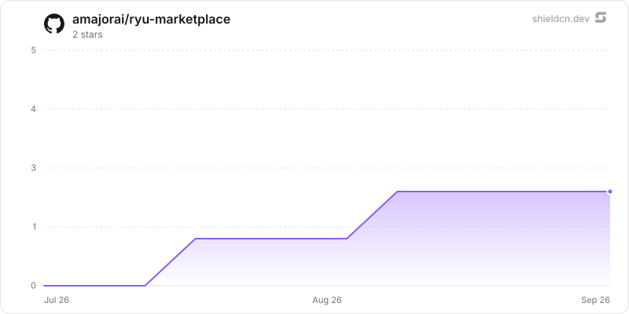

# Ryu Marketplace

The catalog for **Ryu apps, plugins, and portable packages**.

- `.ryu-plugin/marketplace.json` — the generated index. It lists **both**
  tiers: `type: "app"` (apps-store apps, which ship from their own
  `amajorai/ryu-<app>` satellite repos) and `type: "plugin"` (declarative,
  UI-less plugins, whose source is carried here).
  Portable packages are listed in `entries`/`packages` and live under
  `agents/`, `workflows/`, `themes/`, `spaces/`, `profiles/`, and `bundles/`.
- `plugins/plugins/<name>/manifest.json` — the source-of-truth manifest for each
  local first-party plugin; `plugins/lsp/<name>/manifest.json` holds language
  servers; `plugins/external_plugins/<name>/manifest.json` is the matching root
  for hosted/external providers. A declarative plugin IS its manifest.
- `schema/marketplace.schema.json` — the index schema.

This tree is generated from Ryu's monorepo by `tools/mirror-plugins.sh`.
Open a pull request here for corrections or improvements. Maintainers port accepted
changes into the monorepo before a later sync, and generated content may be rewritten.
See [CONTRIBUTING.md](./CONTRIBUTING.md) for package and release guidance.

## Status legend

- **Official** — published by Ryu; this is marketplace provenance, not a runtime state.
- **Built-in** — compiled into the Ryu/Core distribution and available before the marketplace is reachable.
- **System** — a Core-owned/protected runtime package; System is separate from Built-in and does not by itself mean the package is compiled into Core.
- **Pre-installed** — Core creates an enabled lifecycle record for it on a fresh install. It can still be disabled, and it is separate from Built-in and System.
- **Stability** — the manifest's `stability` maturity label (`stable`, `beta`, `alpha`, `rc`, or another declared value), not an update channel. An omitted value is shown as `stable`.
- **Hidden** — kept out of the catalog listing; it does not install, enable, or uninstall anything by itself.

## Apps (72)

Manifest-driven feature apps, grouped by their manifest `category`.

Each links to the repository declared by its manifest; apps with no

explicit repository use the `amajorai/ryu-<app>` satellite fallback.

### Automation

| App | Official | Built-in | System | Pre-installed | Stability | Hidden | Version | What it is |
| :---: | :---: | :---: | :---: | :---: | :---: | :---: | :---: | --- |
| 
<picture><source media="(prefers-color-scheme: dark)" srcset="./app-icons/autopilot-dark.png" /></picture> <a href="https://github.com/amajorai/ryu-autopilot">Autopilot</a>
 | ✓ | ✓ | – | – | experimental | – | 0.4.0 | A positioning-first launch companion. Choose one job, define the market position and narrow ICP,… |
| 
<picture><source media="(prefers-color-scheme: dark)" srcset="./app-icons/predict-dark.png" /></picture> <a href="https://github.com/amajorai/ryu-predict">Autocomplete</a>
 | ✓ | ✓ | – | – | experimental | – | 0.4.0 | Inline ghost-text autocomplete in any text field on your machine, accepted with Tab. A small… |
| 
<picture><source media="(prefers-color-scheme: dark)" srcset="./app-icons/recipes-dark.png" /></picture> <a href="https://github.com/amajorai/ryu-recipes">Recipes</a>
 | ✓ | ✓ | – | – | experimental | – | 0.4.0 | Desktop-automation recipes: record → save → replay UI action sequences. Backed by Ghost's… |
| 
<picture><source media="(prefers-color-scheme: dark)" srcset="./app-icons/warmup-dark.png" /></picture> <a href="https://github.com/amajorai/ryu-warmup">Warmup</a>
 | ✓ | ✓ | – | – | experimental | – | 0.4.0 | Starts your subscription agents' rolling usage windows on your own schedule: a one-word ping to… |
| 
<picture><source media="(prefers-color-scheme: dark)" srcset="./app-icons/webhooks-dark.png" /></picture> <a href="https://github.com/amajorai/ryu-webhooks">Webhooks</a>
 | ✓ | ✓ | – | ✓ | experimental | – | 0.4.0 | Inbound webhook endpoint registry: resolved public URLs, signing-secret configuration,… |
| 
<picture><source media="(prefers-color-scheme: dark)" srcset="./app-icons/workflows-dark.png" /></picture> <a href="https://github.com/amajorai/ryu-workflows">Workflows</a>
 | ✓ | ✓ | – | – | experimental | – | 0.4.0 | Workflows: petgraph DAG automation with triggers, durable execution, and a natural-language… |

### Browsers

| App | Official | Built-in | System | Pre-installed | Stability | Hidden | Version | What it is |
| :---: | :---: | :---: | :---: | :---: | :---: | :---: | :---: | --- |
| 
<picture><source media="(prefers-color-scheme: dark)" srcset="./app-icons/browser-dark.png" /></picture> <a href="https://github.com/amajorai/ryu-browser">Browser</a>
 | ✓ | ✓ | ✓ | – | stable | – | 0.4.0 | A real-Chromium browser (Electron) exposed as the grant-gated `browser.control` capability.… |

### Communication

| App | Official | Built-in | System | Pre-installed | Stability | Hidden | Version | What it is |
| :---: | :---: | :---: | :---: | :---: | :---: | :---: | :---: | --- |
| 
<picture><source media="(prefers-color-scheme: dark)" srcset="./app-icons/help-center-dark.png" /></picture> <a href="https://github.com/amajorai/ryu-help-center">Help Center</a>
 | ✓ | ✓ | – | ✓ | experimental | – | 0.4.0 | A Ryu support workspace for resolving tickets, improving knowledge, and reviewing AI assistance. |
| 
<picture><source media="(prefers-color-scheme: dark)" srcset="./app-icons/mail-dark.png" /></picture> <a href="https://github.com/amajorai/ryu-mail">Mail</a>
 | ✓ | ✓ | – | – | experimental | – | 0.4.0 | Agent Inboxes — email as a service for agents. Runs the out-of-process ryu-mail sidecar; Core… |
| 
<picture><source media="(prefers-color-scheme: dark)" srcset="./app-icons/meetings-dark.png" /></picture> <a href="https://github.com/amajorai/ryu-meetings">Meetings</a>
 | ✓ | ✓ | – | – | experimental | – | 0.4.0 | Meeting notes: record → live transcript → AI notes, auto-saved into the Meetings Space so they… |
| 
<picture><source media="(prefers-color-scheme: dark)" srcset="./app-icons/rooms-dark.png" /></picture> <a href="https://github.com/amajorai/ryu-rooms">Rooms</a>
 | ✓ | ✓ | – | – | experimental | – | 0.4.0 | Shared model rooms hosted by your active Ryu node. Start a Mesh LLM session on the node, invite… |
| 
<picture><source media="(prefers-color-scheme: dark)" srcset="./app-icons/teams-dark.png" /></picture> <a href="https://github.com/amajorai/ryu-teams">Groups</a>
 | ✓ | ✓ | – | – | experimental | – | 0.4.0 | Groups: named collections of agents you can address as one. Governance shell over the… |
| 
<picture><source media="(prefers-color-scheme: dark)" srcset="./app-icons/whatsapp-dark.png" /></picture> <a href="https://github.com/amajorai/ryu-whatsapp">WhatsApp</a>
 | ✓ | ✓ | – | ✓ | experimental | – | 0.4.0 | Connect WhatsApp Personal or WhatsApp Business (Cloud API) to a Ryu agent or team from a native… |

### Creative

| App | Official | Built-in | System | Pre-installed | Stability | Hidden | Version | What it is |
| :---: | :---: | :---: | :---: | :---: | :---: | :---: | :---: | --- |
| 
<picture><source media="(prefers-color-scheme: dark)" srcset="./app-icons/backstage-dark.png" /></picture> <a href="https://github.com/amajorai/backstage">Backstage</a>
 | ✓ | ✓ | – | – | experimental | – | 0.4.0 | A local-first YouTube thumbnail studio that keeps its editor while using Ryu for governed model… |
| 
<picture><source media="(prefers-color-scheme: dark)" srcset="./app-icons/canvas-dark.png" /></picture> <a href="https://github.com/amajorai/ryu-canvas">Canvas</a>
 | ✓ | ✓ | – | – | experimental | – | 0.4.0 | A node board for generative media: wire up image, video, chat, text-to-speech, speech-to-text,… |
| 
<picture><source media="(prefers-color-scheme: dark)" srcset="./app-icons/content-dark.png" /></picture> <a href="https://github.com/amajorai/ryu-content">Content</a>
 | ✓ | ✓ | – | – | experimental | – | 0.4.0 | A list-only catalog preview for planned local-first content projects, schedules, and performance… |
| 
<picture><source media="(prefers-color-scheme: dark)" srcset="./app-icons/drawesome-dark.png" /></picture> <a href="https://github.com/amajorai/ryu-drawesome">Drawesome</a>
 | ✓ | ✓ | – | – | experimental | – | 0.4.0 | A lightweight sketching studio for Ryu with seven natural-feeling pens, area erasing, SVG or PNG… |
| 
<picture><source media="(prefers-color-scheme: dark)" srcset="./app-icons/reelfarm-dark.png" /></picture> <a href="https://github.com/amajorai/ryu-reelfarm">Studio</a>
 | ✓ | ✓ | – | – | experimental | – | 0.4.0 | A local-first content queue for short-form ideas, hooks, visual direction, and planned publish… |
| 
<picture><source media="(prefers-color-scheme: dark)" srcset="./app-icons/slides-dark.png" /></picture> <a href="https://github.com/amajorai/ryu-slides">Slides</a>
 | ✓ | ✓ | – | – | experimental | – | 0.4.0 | Create, edit, organize, preview, import, and export carousel frames locally with Ryu's media tools. |
| 
<picture><source media="(prefers-color-scheme: dark)" srcset="./app-icons/video-studio-dark.png" /></picture> <a href="https://github.com/amajorai/ryu-video-studio">Video Studio</a>
 | ✓ | – | – | – | experimental | – | 0.4.0 | Edit layered video timelines, review storyboards, add timed captions, and render finished videos… |
| 
<picture><source media="(prefers-color-scheme: dark)" srcset="./app-icons/whiteboard-dark.png" /></picture> <a href="https://github.com/amajorai/ryu-whiteboard">Whiteboard</a>
 | ✓ | ✓ | – | – | experimental | – | 0.4.0 | An Excalidraw whiteboard shipped as a Ryu app: draw, diagram, and rearrange freely, insert… |

### Developer Tools

| App | Official | Built-in | System | Pre-installed | Stability | Hidden | Version | What it is |
| :---: | :---: | :---: | :---: | :---: | :---: | :---: | :---: | --- |
| 
<picture><source media="(prefers-color-scheme: dark)" srcset="./app-icons/blueprint-dark.png" /></picture> <a href="https://github.com/amajorai/ryu-blueprint">Blueprint</a>
 | ✓ | ✓ | – | – | experimental | – | 0.4.0 | Review an agent's plan before it touches a file. The agent publishes its plan over MCP;… |
| 
<picture><source media="(prefers-color-scheme: dark)" srcset="./app-icons/checks-dark.png" /></picture> <a href="https://github.com/amajorai/ryu-checks">Tests</a>
 | ✓ | ✓ | – | – | experimental | – | 0.4.0 | A node-local agentic verification workspace for exploring live targets, generating UI/API plans,… |
| 
<picture><source media="(prefers-color-scheme: dark)" srcset="./app-icons/desktop-dark.png" /></picture> <a href="https://github.com/amajorai/ryu-desktop">Virtual Desktop</a>
 | ✓ | ✓ | – | – | experimental | – | 0.4.0 | An interactive Linux virtual desktop for Ryu nodes. The app sidecar owns stable per-Bot screens… |
| 
<picture><source media="(prefers-color-scheme: dark)" srcset="./app-icons/finetune-dark.png" /></picture> <a href="https://github.com/amajorai/ryu-finetune">Fine-tuning</a>
 | ✓ | ✓ | – | – | experimental | – | 0.4.0 | A LoRA/QLoRA training studio: launch fine-tune jobs on this node's GPU or a remote Ryu Cloud GPU… |
| 
<picture><source media="(prefers-color-scheme: dark)" srcset="./app-icons/healing-dark.png" /></picture> <a href="https://github.com/amajorai/ryu-healing">Self-Healing</a>
 | ✓ | ✓ | – | – | experimental | – | 0.4.0 | Self-healing: failed runs are diagnosed by a Gateway side-model and proposed fixes are delivered… |
| 
<picture><source media="(prefers-color-scheme: dark)" srcset="./app-icons/monitors-dark.png" /></picture> <a href="https://github.com/amajorai/ryu-monitors">Monitors</a>
 | ✓ | ✓ | – | – | experimental | – | 0.4.0 | Website monitors: price, stock, keyword, content, and uptime watches with cross-device… |
| 
<picture><source media="(prefers-color-scheme: dark)" srcset="./app-icons/mpp-dark.png" /></picture> <a href="https://github.com/amajorai/ryu-mpp">Payments</a>
 | ✓ | ✓ | – | – | experimental | – | 0.4.0 | Discover services that speak the Machine Payments Protocol, review exact Tempo testnet charges,… |
| 
<picture><source media="(prefers-color-scheme: dark)" srcset="./app-icons/pull-requests-dark.png" /></picture> <a href="https://github.com/amajorai/ryu-pull-requests">Pull Requests</a>
 | ✓ | ✓ | – | – | experimental | – | 0.4.0 | A focused GitHub work inbox for Ryu. Browse pull requests and issues across repositories,… |
| 
<picture><source media="(prefers-color-scheme: dark)" srcset="./app-icons/simulator-dark.png" /></picture> <a href="https://github.com/amajorai/ryu-simulator">Simulators</a>
 | ✓ | ✓ | – | – | experimental | – | 0.4.0 | Drive iOS Simulators (macOS + Xcode) and Android Emulators from a workspace tab. Ryu runs the… |
| 
<picture><source media="(prefers-color-scheme: dark)" srcset="./app-icons/sites-dark.png" /></picture> <a href="https://github.com/amajorai/ryu-sites">Sites</a>
 | ✓ | ✓ | – | ✓ | experimental | – | 0.4.0 | Create, refine, save and deploy websites with private access, browser-local data and scoped Ryu… |
| 
<picture><source media="(prefers-color-scheme: dark)" srcset="./app-icons/skill-editor-dark.png" /></picture> <a href="https://github.com/amajorai/ryu-skill-editor">Skill Editor</a>
 | ✓ | ✓ | – | – | experimental | – | 0.4.0 | Author a user-owned Agent Skill (SKILL.md): front-matter fields (name / description / allowed… |

### Documents

| App | Official | Built-in | System | Pre-installed | Stability | Hidden | Version | What it is |
| :---: | :---: | :---: | :---: | :---: | :---: | :---: | :---: | --- |
| 
<picture><source media="(prefers-color-scheme: dark)" srcset="./app-icons/anydoc-dark.png" /></picture> <a href="https://github.com/amajorai/ryu-anydoc">AnyDoc</a>
 | ✓ | ✓ | – | – | experimental | – | 0.4.0 | Document extraction through Firecrawl's MIT-licensed AnyDoc Rust library. It converts Word,… |
| 
<picture><source media="(prefers-color-scheme: dark)" srcset="./app-icons/convert-dark.png" /></picture> <a href="https://github.com/amajorai/ryu-convert">Convert</a>
 | ✓ | ✓ | – | – | experimental | – | 0.4.0 | A local-only conversion studio for image output and editing, PDF organization and page… |
| 
<picture><source media="(prefers-color-scheme: dark)" srcset="./app-icons/docling-dark.png" /></picture> <a href="https://github.com/amajorai/ryu-docling">Docling</a>
 | ✓ | ✓ | – | – | experimental | – | 0.4.0 | Document parsing via IBM's MIT-licensed Docling — the highest-fidelity `document.parse` backend.… |
| 
<picture><source media="(prefers-color-scheme: dark)" srcset="./app-icons/markitdown-dark.png" /></picture> <a href="https://github.com/amajorai/ryu-markitdown">MarkItDown</a>
 | ✓ | ✓ | – | ✓ | experimental | – | 0.4.0 | Document parsing via Microsoft's MIT-licensed MarkItDown library — the default `document.parse`… |
| 
<picture><source media="(prefers-color-scheme: dark)" srcset="./app-icons/mineru-dark.png" /></picture> <a href="https://github.com/amajorai/ryu-mineru">MinerU</a>
 | ✓ | ✓ | – | – | experimental | – | 0.4.0 | Document parsing via MinerU (opendatalab) — the highest-fidelity `document.parse` backend, and… |
| 
<picture><source media="(prefers-color-scheme: dark)" srcset="./app-icons/unstructured-dark.png" /></picture> <a href="https://github.com/amajorai/ryu-unstructured">Unstructured</a>
 | ✓ | ✓ | – | – | experimental | – | 0.4.0 | Document parsing via the Apache-2.0 Unstructured library — the broadest-coverage… |

### Games

| App | Official | Built-in | System | Pre-installed | Stability | Hidden | Version | What it is |
| :---: | :---: | :---: | :---: | :---: | :---: | :---: | :---: | --- |
| 
<picture><source media="(prefers-color-scheme: dark)" srcset="./app-icons/token-table-dark.png" /></picture> <a href="https://github.com/amajorai/ryu-token-table">Token Table</a>
 | ✓ | ✓ | – | – | experimental | – | 0.4.0 | A catalog preview of a planned cosmetic six-max Texas Hold'em table with simulated tokens. |

### Knowledge & Memory

| App | Official | Built-in | System | Pre-installed | Stability | Hidden | Version | What it is |
| :---: | :---: | :---: | :---: | :---: | :---: | :---: | :---: | --- |
| 
<picture><source media="(prefers-color-scheme: dark)" srcset="./app-icons/bookmarks-dark.png" /></picture> <a href="https://github.com/amajorai/ryu-bookmarks">Bookmarks</a>
 | ✓ | ✓ | – | – | experimental | – | 0.4.0 | A self-organizing bookmark library with HTML/browser imports, notes, inferred collections, and… |
| 
<picture><source media="(prefers-color-scheme: dark)" srcset="./app-icons/learning-dark.png" /></picture> <a href="https://github.com/amajorai/ryu-learning">Learning</a>
 | ✓ | ✓ | – | ✓ | experimental | – | 0.4.0 | Learning loop: turn chats and runs into reusable skills, gated by the approval Inbox, with an… |
| 
<picture><source media="(prefers-color-scheme: dark)" srcset="./app-icons/life-recorder-dark.png" /></picture> <a href="https://github.com/amajorai/ryu-life-recorder">Life Recorder</a>
 | ✓ | ✓ | – | – | experimental | – | 0.4.0 | Recall recent speech with Shadow, transcribe recordings, and keep private conversation recaps… |

### Media & Voice

| App | Official | Built-in | System | Pre-installed | Stability | Hidden | Version | What it is |
| :---: | :---: | :---: | :---: | :---: | :---: | :---: | :---: | --- |
| 
<picture><source media="(prefers-color-scheme: dark)" srcset="./app-icons/clips-dark.png" /></picture> <a href="https://github.com/amajorai/ryu-clips">Clips</a>
 | ✓ | ✓ | – | – | experimental | – | 0.4.0 | A local-first video capture and ingest surface with a bundled editor preview. The out-of-process… |
| 
<picture><source media="(prefers-color-scheme: dark)" srcset="./app-icons/dictation-dark.png" /></picture> <a href="https://github.com/amajorai/ryu-dictation">Dictation</a>
 | ✓ | ✓ | – | ✓ | experimental | – | 0.4.0 | System-wide dictation and agent-ask via the Island companion: speak anywhere to type a raw or… |
| 
<picture><source media="(prefers-color-scheme: dark)" srcset="./app-icons/subtitles-dark.png" /></picture> <a href="https://github.com/amajorai/ryu-subtitles">Subtitles</a>
 | ✓ | ✓ | – | – | experimental | – | 0.4.0 | Pick a video on this machine, transcribe it locally, translate the transcript into the language… |
| 
<picture><source media="(prefers-color-scheme: dark)" srcset="./app-icons/voice-dark.png" /></picture> <a href="https://github.com/amajorai/ryu-voice">Voice</a>
 | ✓ | ✓ | – | ✓ | experimental | – | 0.4.0 | Voice data path: speech-to-text transcription (whisper.cpp) and text-to-speech (OuteTTS + the… |

### Productivity

| App | Official | Built-in | System | Pre-installed | Stability | Hidden | Version | What it is |
| :---: | :---: | :---: | :---: | :---: | :---: | :---: | :---: | --- |
| 
<picture><source media="(prefers-color-scheme: dark)" srcset="./app-icons/activity-dark.png" /></picture> <a href="https://github.com/amajorai/ryu-activity">Activity</a>
 | ✓ | ✓ | – | – | experimental | – | 0.4.0 | The unified activity feed and agent observability workspace: inspect local audits, correlated… |
| 
<picture><source media="(prefers-color-scheme: dark)" srcset="./app-icons/agent-status-dark.png" /></picture> <a href="https://github.com/amajorai/ryu-agent-status">Agent Status</a>
 | ✓ | ✓ | – | – | experimental | – | 0.4.0 | Splits your agent runs across three sidebar sections — Working, Needs input and Done — each row… |
| 
<picture><source media="(prefers-color-scheme: dark)" srcset="./app-icons/calendar-dark.png" /></picture> <a href="https://github.com/amajorai/ryu-calendar">Calendar</a>
 | ✓ | ✓ | – | ✓ | experimental | – | 0.4.0 | The scheduled-runs calendar: every agent and workflow scheduled job projected onto Month, Week,… |
| 
<picture><source media="(prefers-color-scheme: dark)" srcset="./app-icons/chat-broadcast-dark.png" /></picture> <a href="https://github.com/amajorai/ryu-chat-broadcast">Chat Broadcast</a>
 | ✓ | ✓ | – | ✓ | experimental | – | 0.4.0 | Send one message to every running chat or a hand-picked set of visible chats, including idle… |
| 
<picture><source media="(prefers-color-scheme: dark)" srcset="./app-icons/crm-dark.png" /></picture> <a href="https://github.com/amajorai/ryu-crm">Harbor</a>
 | ✓ | ✓ | – | – | experimental | – | 0.4.0 | A CRM that starts as a data model rather than a fixed set of screens. Harbor ships the five… |
| 
<picture><source media="(prefers-color-scheme: dark)" srcset="./app-icons/dashboards-dark.png" /></picture> <a href="https://github.com/amajorai/ryu-dashboards">Dashboards</a>
 | ✓ | ✓ | – | – | experimental | – | 0.4.0 | Dashboards: composable widget boards that assemble live views over monitors, meetings, quests,… |
| 
<picture><source media="(prefers-color-scheme: dark)" srcset="./app-icons/drafts-dark.png" /></picture> <a href="https://github.com/amajorai/ryu-drafts">Drafts</a>
 | ✓ | ✓ | – | – | experimental | – | 0.4.0 | A durable outbox for messages you have not sent yet. Anything you type into a composer and walk… |
| 
<picture><source media="(prefers-color-scheme: dark)" srcset="./app-icons/expenses-dark.png" /></picture> <a href="https://github.com/amajorai/ryu-expenses">Expenses</a>
 | ✓ | ✓ | – | – | experimental | – | 0.4.0 | A local-first expense ledger for Ryu: record spending through an agent or the companion, then… |
| 
<picture><source media="(prefers-color-scheme: dark)" srcset="./app-icons/feedback-board-dark.png" /></picture> <a href="https://github.com/amajorai/ryu-feedback-board">Feedback Board</a>
 | ✓ | ✓ | – | – | experimental | – | 0.4.0 | A public feedback board and private Ryu product workspace: collect requests, votes, and… |
| 
<picture><source media="(prefers-color-scheme: dark)" srcset="./app-icons/invoices-dark.png" /></picture> <a href="https://github.com/amajorai/ryu-invoices">Invoices</a>
 | ✓ | ✓ | – | – | experimental | – | 0.4.0 | A local invoice register for tracking what was issued, what is overdue, and what has been paid.… |
| 
<picture><source media="(prefers-color-scheme: dark)" srcset="./app-icons/mission-control-dark.png" /></picture> <a href="https://github.com/amajorai/ryu-mission-control">Mission Control</a>
 | ✓ | ✓ | – | – | experimental | – | 0.4.0 | The project-level view over many chats: recent sessions and what each one accomplished, per-day… |
| 
<picture><source media="(prefers-color-scheme: dark)" srcset="./app-icons/news-dark.png" /></picture> <a href="https://github.com/amajorai/ryu-news">Wire</a>
 | ✓ | ✓ | – | – | experimental | – | 0.4.0 | Your own newsroom, running on your node. Wire pulls RSS, Atom and JSON Feed in on a schedule —… |
| 
<picture><source media="(prefers-color-scheme: dark)" srcset="./app-icons/outreach-dark.png" /></picture> <a href="https://github.com/amajorai/ryu-outreach">Outreach</a>
 | ✓ | ✓ | – | – | experimental | – | 0.4.0 | A local-first campaign workspace for thoughtful outbound work. Keep a small audience brief,… |
| 
<picture><source media="(prefers-color-scheme: dark)" srcset="./app-icons/people-dark.png" /></picture> <a href="https://github.com/amajorai/ryu-people">People</a>
 | ✓ | ✓ | – | – | experimental | – | 0.4.0 | A private local people directory for team roles, onboarding, and leave status. People keeps… |
| 
<picture><source media="(prefers-color-scheme: dark)" srcset="./app-icons/projects-dark.png" /></picture> <a href="https://github.com/amajorai/ryu-projects">Projects</a>
 | ✓ | ✓ | – | – | experimental | – | 0.4.0 | A durable coordinator workspace for turning long-running work into owned tasks, shared context,… |
| 
<picture><source media="(prefers-color-scheme: dark)" srcset="./app-icons/quests-dark.png" /></picture> <a href="https://github.com/amajorai/ryu-quests">Quests</a>
 | ✓ | ✓ | – | – | experimental | – | 0.4.0 | Quests: auto-detecting todos surfaced from your chats and activity, tracked as a lightweight… |
| 
<picture><source media="(prefers-color-scheme: dark)" srcset="./app-icons/rlm-dark.png" /></picture> <a href="https://github.com/amajorai/ryu-rlm">Recursive Language Model</a>
 | ✓ | ✓ | – | – | experimental | – | 0.4.0 | Answer questions about a corpus far larger than any model's context window — without putting it… |
| 
<picture><source media="(prefers-color-scheme: dark)" srcset="./app-icons/social-dark.png" /></picture> <a href="https://github.com/amajorai/ryu-social">Outpost</a>
 | ✓ | ✓ | – | – | experimental | – | 0.4.0 | A publishing command center for every social account you run: compose once, tailor per platform,… |
| 
<picture><source media="(prefers-color-scheme: dark)" srcset="./app-icons/timeline-dark.png" /></picture> <a href="https://github.com/amajorai/ryu-timeline">Timeline</a>
 | ✓ | ✓ | – | – | experimental | – | 0.4.0 | The activity timeline with Replay lanes and a chronological History view over Shadow's captured… |
| 
<picture><source media="(prefers-color-scheme: dark)" srcset="./app-icons/tuition-dark.png" /></picture> <a href="https://github.com/amajorai/ryu-tuition">Tuition</a>
 | ✓ | ✓ | – | – | experimental | – | 0.4.0 | A tutor for one learner — you. Point it at your own syllabus, chapter or notes and it builds a… |
| 
<picture><source media="(prefers-color-scheme: dark)" srcset="./app-icons/ugc-dark.png" /></picture> <a href="https://github.com/amajorai/ryu-ugc">UGC</a>
 | ✓ | ✓ | – | – | experimental | – | 0.4.0 | Creator-marketing campaign tracker: briefs, a creator roster, post submissions with review,… |

### Research

| App | Official | Built-in | System | Pre-installed | Stability | Hidden | Version | What it is |
| :---: | :---: | :---: | :---: | :---: | :---: | :---: | :---: | --- |
| 
<picture><source media="(prefers-color-scheme: dark)" srcset="./app-icons/research-dark.png" /></picture> <a href="https://github.com/amajorai/ryu-research">Research</a>
 | ✓ | ✓ | – | – | experimental | – | 0.4.0 | Run durable autoresearch campaigns with one-shot proposals, direction-aware winners, bounded… |

### Security

| App | Official | Built-in | System | Pre-installed | Stability | Hidden | Version | What it is |
| :---: | :---: | :---: | :---: | :---: | :---: | :---: | :---: | --- |
| 
<picture><source media="(prefers-color-scheme: dark)" srcset="./app-icons/approvals-dark.png" /></picture> <a href="https://github.com/amajorai/ryu-approvals">Approvals</a>
 | ✓ | ✓ | – | – | experimental | – | 0.4.0 | Approval inbox: a human-in-the-loop queue where agent-proposed actions, edits, and fixes wait… |
| 
<picture><source media="(prefers-color-scheme: dark)" srcset="./app-icons/reasoning-dark.png" /></picture> <a href="https://github.com/amajorai/ryu-reasoning">Automated Reasoning</a>
 | ✓ | ✓ | – | – | experimental | – | 0.4.0 | Check an answer against a written policy with a solver instead of a second opinion. Point it at… |
| 
<picture><source media="(prefers-color-scheme: dark)" srcset="./app-icons/safe-actions-dark.png" /></picture> <a href="https://github.com/amajorai/ryu-safe-actions">Safe Actions</a>
 | ✓ | – | – | – | experimental | – | 0.4.0 | Review and govern typed tool plans before they can touch the world. Safe Actions shows the exact… |
| 
<picture><source media="(prefers-color-scheme: dark)" srcset="./app-icons/security-dark.png" /></picture> <a href="https://github.com/amajorai/ryu/tree/main/apps-store/security">Security</a>
 | ✓ | ✓ | – | – | experimental | – | 0.4.0 | A local-first security workbench for reviewing authorized repositories, validating static… |

## Third-party listings (GitHub topic discovery)

Third-party apps and plugins are discovered automatically from GitHub
topics — add **`ryu-app`** or **`ryu-plugin`** to your repository and it
becomes discoverable in the Ryu marketplace (desktop + web).

> Listings discovered by topic are **not reviewed** by Ryu. Install at
> your own discretion — read the manifest, check what permission grants
> it requests, and prefer repos you can audit.

## First-party plugins (80)

Declarative `@ryu/*` plugins, grouped by their manifest `category`.

### Automation

| Plugin | Official | Built-in | System | Pre-installed | Stability | Hidden | Layer | Version | What it is |
| :---: | :---: | :---: | :---: | :---: | :---: | :---: | :---: | :---: | --- |
| 
<picture><source media="(prefers-color-scheme: dark)" srcset="./plugins/plugins/agent-comms/icon-dark.png" /></picture> <a href="./plugins/plugins/agent-comms/">Switchboard</a>
 | ✓ | ✓ | – | – | experimental | – | – | 0.4.0 | Lets the agents on this node talk to each other. Any agent can look up who else is here, leave… |
| 
<picture><source media="(prefers-color-scheme: dark)" srcset="./plugins/plugins/bytebot/icon-dark.png" /></picture> <a href="./plugins/plugins/bytebot/">Bytebot Desktop</a>
 | ✓ | ✓ | – | – | experimental | – | – | 0.4.0 | Drives a Bytebot desktop (https://github.com/bytebot-ai/bytebot) through `bytebotd`, its local… |
| 
<picture><source media="(prefers-color-scheme: dark)" srcset="./plugins/plugins/effort-escalator/icon-dark.png" /></picture> <a href="./plugins/plugins/effort-escalator/">Effort Escalator</a>
 | ✓ | ✓ | – | – | experimental | – | – | 0.4.0 | Detects stalled work with a cheap background judge and moves the next turn up a configured… |
| 
<picture><source media="(prefers-color-scheme: dark)" srcset="./plugins/plugins/ghost/icon-dark.png" /></picture> <a href="./plugins/plugins/ghost/">Ghost</a>
 | ✓ | ✓ | ✓ | ✓ | stable | – | – | 0.4.0 | Desktop automation: 29 screen perception and input control tools. Cross-platform (Windows,… |
| 
<picture><source media="(prefers-color-scheme: dark)" srcset="./plugins/plugins/pi-subagent/icon-dark.png" /></picture> <a href="./plugins/plugins/pi-subagent/">Subagents</a>
 | ✓ | ✓ | – | ✓ | experimental | – | – | 0.4.0 | Adds the Task tool to the managed Pi agent, so it can delegate a bounded, context-isolated job… |
| 
<picture><source media="(prefers-color-scheme: dark)" srcset="./plugins/plugins/usage-pacer/icon-dark.png" /></picture> <a href="./plugins/plugins/usage-pacer/">Usage Pacer</a>
 | ✓ | ✓ | – | – | experimental | – | – | 0.4.0 | Keeps subscription agents usable for the whole rolling window. It can pace usage down with a… |

### Browsers

| Plugin | Official | Built-in | System | Pre-installed | Stability | Hidden | Layer | Version | What it is |
| :---: | :---: | :---: | :---: | :---: | :---: | :---: | :---: | :---: | --- |
| 
<picture><source media="(prefers-color-scheme: dark)" srcset="./plugins/plugins/agentbrowser/icon-dark.png" /></picture> <a href="./plugins/plugins/agentbrowser/">Agent Browser</a>
 | ✓ | ✓ | ✓ | ✓ | stable | – | – | 0.4.0 | Browser automation via the `agent-browser` CLI's MCP server (https://agent-browser.dev).… |
| 
<picture><source media="(prefers-color-scheme: dark)" srcset="./plugins/plugins/ego-browser/icon-dark.png" /></picture> <a href="./plugins/plugins/ego-browser/">Ego Browser</a>
 | ✓ | ✓ | – | – | experimental | – | – | 0.4.0 | Ego lite (https://github.com/citrolabs/ego-lite) as an optional provider for Ryu's swappable… |

### Developer Tools

| Plugin | Official | Built-in | System | Pre-installed | Stability | Hidden | Layer | Version | What it is |
| :---: | :---: | :---: | :---: | :---: | :---: | :---: | :---: | :---: | --- |
| 
<picture><source media="(prefers-color-scheme: dark)" srcset="./plugins/plugins/agentation/icon-dark.png" /></picture> <a href="./plugins/plugins/agentation/">Agentation</a>
 | ✓ | ✓ | – | – | experimental | – | – | 0.4.0 | Visual feedback for coding agents. Agentation connects UI annotations from a running web app to… |
| 
<picture><source media="(prefers-color-scheme: dark)" srcset="./plugins/plugins/agents-md-tail/icon-dark.png" /></picture> <a href="./plugins/plugins/agents-md-tail/">AGENTS.md Tail</a>
 | ✓ | ✓ | – | – | experimental | – | – | 0.4.0 | Experimental context hook that keeps the active AGENTS.md instructions at the head and repeats… |
| 
<picture><source media="(prefers-color-scheme: dark)" srcset="./plugins/plugins/docs/icon-dark.png" /></picture> <a href="./plugins/plugins/docs/">Ryu Docs</a>
 | ✓ | ✓ | ✓ | ✓ | stable | – | – | 0.4.0 | Read-only MCP access to the Ryu documentation on docs.ryuhq.com — search the docs and pull any… |
| 
<picture><source media="(prefers-color-scheme: dark)" srcset="./plugins/plugins/dynamic-workflows/icon-dark.png" /></picture> <a href="./plugins/plugins/dynamic-workflows/">dynamic-workflows</a>
 | ✓ | ✓ | – | – | experimental | – | – | 0.4.0 | Run a validated, bounded fan-out of clean-context delegates. |
| 
<picture><source media="(prefers-color-scheme: dark)" srcset="./plugins/plugins/expect/icon-dark.png" /></picture> <a href="./plugins/plugins/expect/">Expect</a>
 | ✓ | ✓ | – | – | experimental | – | – | 0.4.0 | Browser-based QA for agent code. Expect reads the current changes, creates a test plan, and runs… |
| 
<picture><source media="(prefers-color-scheme: dark)" srcset="./plugins/plugins/headroom/icon-dark.png" /></picture> <a href="./plugins/plugins/headroom/">Headroom Compression</a>
 | ✓ | ✓ | – | – | experimental | – | – | 0.4.0 | Context compression (chopratejas/headroom): compress tool outputs, logs, files, and RAG chunks.… |
| 
<picture><source media="(prefers-color-scheme: dark)" srcset="./plugins/plugins/hook-observers/icon-dark.png" /></picture> <a href="./plugins/plugins/hook-observers/">Hook Observers</a>
 | ✓ | – | – | – | experimental | – | – | 0.4.0 | A worked reference for the turn-hook events Ryu can fire: five observer hooks watching… |
| 
<picture><source media="(prefers-color-scheme: dark)" srcset="./plugins/plugins/hook-session-context/icon-dark.png" /></picture> <a href="./plugins/plugins/hook-session-context/">Session Context</a>
 | ✓ | ✓ | – | – | experimental | – | – | 0.4.0 | Injects the current date and time at the start of every session, so the agent stops guessing… |
| 
<picture><source media="(prefers-color-scheme: dark)" srcset="./plugins/plugins/pi-monitor/icon-dark.png" /></picture> <a href="./plugins/plugins/pi-monitor/">Monitor</a>
 | ✓ | ✓ | – | ✓ | experimental | – | – | 0.4.0 | Adds the monitor tool to the managed Pi agent, so it can watch a command or WebSocket in the… |
| 
<picture><source media="(prefers-color-scheme: dark)" srcset="./plugins/plugins/pi-shell/icon-dark.png" /></picture> <a href="./plugins/plugins/pi-shell/">Background Bash</a>
 | ✓ | ✓ | – | ✓ | experimental | – | – | 0.4.0 | Adds bash_background / bash_output / bash_kill to the managed Pi agent, so a long-running… |
| 
<picture><source media="(prefers-color-scheme: dark)" srcset="./plugins/plugins/pxpipe/icon-dark.png" /></picture> <a href="./plugins/plugins/pxpipe/">pxpipe</a>
 | ✓ | ✓ | – | – | experimental | – | – | 0.4.0 | Token-saving loopback proxy (https://github.com/teamchong/pxpipe): it renders the bulky, static… |
| 
<picture><source media="(prefers-color-scheme: dark)" srcset="./plugins/plugins/rtk/icon-dark.png" /></picture> <a href="./plugins/plugins/rtk/">RTK (Rust Token Killer)</a>
 | ✓ | ✓ | – | – | experimental | – | – | 0.4.0 | Run a dev command through RTK (Rust Token Killer) and get a token-compressed version of its… |
| 
<picture><source media="(prefers-color-scheme: dark)" srcset="./plugins/plugins/rules/icon-dark.png" /></picture> <a href="./plugins/plugins/rules/">Rules</a>
 | ✓ | ✓ | – | ✓ | experimental | – | – | 0.4.0 | Discover Cursor- and Claude-style project rules and apply them to agent context, with per-agent… |
| 
<picture><source media="(prefers-color-scheme: dark)" srcset="./plugins/plugins/sample/icon-dark.png" /></picture> <a href="./plugins/plugins/sample/">Research Assistant</a>
 | ✓ | – | – | – | experimental | ✓ | – | 0.4.0 | The reference plugin: a minimal example that declares one of each runnable kind — an agent, a… |
| 
<picture><source media="(prefers-color-scheme: dark)" srcset="./plugins/plugins/sample-widget/icon-dark.png" /></picture> <a href="./plugins/plugins/sample-widget/">Sample Widget</a>
 | ✓ | ✓ | – | – | experimental | ✓ | – | 0.4.0 | Reference third-party MCP widget plugin. A tiny local Node MCP server (server.mjs) exposes one… |
| 
<picture><source media="(prefers-color-scheme: dark)" srcset="./plugins/plugins/toolsmith-example/icon-dark.png" /></picture> <a href="./plugins/plugins/toolsmith-example/">toolsmith-example</a>
 | ✓ | – | – | – | experimental | ✓ | – | 0.4.0 | Worked example for tools/toolsmith — a real, verified inline_deno tool. Not registered with Core… |

### Knowledge & Memory

| Plugin | Official | Built-in | System | Pre-installed | Stability | Hidden | Layer | Version | What it is |
| :---: | :---: | :---: | :---: | :---: | :---: | :---: | :---: | :---: | --- |
| 
<picture><source media="(prefers-color-scheme: dark)" srcset="./plugins/plugins/honcho/icon-dark.png" /></picture> <a href="./plugins/plugins/honcho/">Honcho</a>
 | ✓ | ✓ | – | – | experimental | – | – | 0.4.0 | Give the swappable `memory` layer a provider that MODELS the user instead of only storing rows,… |
| 
<picture><source media="(prefers-color-scheme: dark)" srcset="./plugins/plugins/mem0/icon-dark.png" /></picture> <a href="./plugins/plugins/mem0/">Mem0</a>
 | ✓ | ✓ | – | – | experimental | – | – | 0.4.0 | Read and write a hosted Mem0 memory project (https://mem0.ai) through the Mem0 Platform REST… |
| 
<picture><source media="(prefers-color-scheme: dark)" srcset="./plugins/plugins/no-more-mistakes/icon-dark.png" /></picture> <a href="./plugins/plugins/no-more-mistakes/">No More Mistakes</a>
 | ✓ | ✓ | – | – | experimental | – | – | 0.4.0 | Notices when you correct the agent, proposes a one-line lesson for your confirmation, and hands… |
| 
<picture><source media="(prefers-color-scheme: dark)" srcset="./plugins/plugins/shadow/icon-dark.png" /></picture> <a href="./plugins/plugins/shadow/">Shadow</a>
 | ✓ | ✓ | ✓ | ✓ | stable | – | – | 0.4.0 | Search everything Shadow has captured (screen text, audio transcripts, input) and summarize… |

### Models

| Plugin | Official | Built-in | System | Pre-installed | Stability | Hidden | Layer | Version | What it is |
| :---: | :---: | :---: | :---: | :---: | :---: | :---: | :---: | :---: | --- |
| 
<picture><source media="(prefers-color-scheme: dark)" srcset="./plugins/plugins/chatgpt-web/icon-dark.png" /></picture> <a href="./plugins/plugins/chatgpt-web/">ChatGPT Web</a>
 | ✓ | – | – | – | experimental | – | – | 0.4.0 | Use a ChatGPT Web subscription through Ryu's signed-in Browser app as an OpenAI-compatible model… |

### Productivity

| Plugin | Official | Built-in | System | Pre-installed | Stability | Hidden | Layer | Version | What it is |
| :---: | :---: | :---: | :---: | :---: | :---: | :---: | :---: | :---: | --- |
| 
<picture><source media="(prefers-color-scheme: dark)" srcset="./plugins/plugins/action-summary/icon-dark.png" /></picture> <a href="./plugins/plugins/action-summary/">Action Summary</a>
 | ✓ | – | – | – | experimental | – | – | 0.4.0 | Explains streamed thinking blocks and tool calls in one plain-language line per action, using a… |
| 
<picture><source media="(prefers-color-scheme: dark)" srcset="./plugins/plugins/ambient-elevator/icon-dark.png" /></picture> <a href="./plugins/plugins/ambient-elevator/">Ambient Elevator</a>
 | ✓ | ✓ | – | – | experimental | – | – | 0.4.0 | Plays one low-volume elevator track while any Ryu agent is actively working, then stops when the… |
| 
<picture><source media="(prefers-color-scheme: dark)" srcset="./plugins/plugins/auto-continue/icon-dark.png" /></picture> <a href="./plugins/plugins/auto-continue/">Auto Continue</a>
 | ✓ | ✓ | – | – | experimental | – | – | 0.4.0 | After each turn while armed, a local sub-agent scans the reply and the workspace for work that… |
| 
<picture><source media="(prefers-color-scheme: dark)" srcset="./plugins/plugins/chat-title/icon-dark.png" /></picture> <a href="./plugins/plugins/chat-title/">Chat Title</a>
 | ✓ | ✓ | – | ✓ | experimental | – | – | 0.4.0 | Auto-renames a chat as soon as the first reply lands, then again after every N completed… |
| 
<picture><source media="(prefers-color-scheme: dark)" srcset="./plugins/plugins/expanded-composer/icon-dark.png" /></picture> <a href="./plugins/plugins/expanded-composer/">Expanded Composer</a>
 | ✓ | ✓ | – | ✓ | experimental | – | – | 0.4.0 | Expand the current chat composer in place while keeping the same draft, attachments, and send… |
| 
<picture><source media="(prefers-color-scheme: dark)" srcset="./plugins/plugins/ghost-chats/icon-dark.png" /></picture> <a href="./plugins/plugins/ghost-chats/">Temporary Chats</a>
 | ✓ | ✓ | – | ✓ | experimental | – | – | 0.4.0 | Start a private temporary chat that stays in the current tab and leaves no conversation history,… |
| 
<picture><source media="(prefers-color-scheme: dark)" srcset="./plugins/plugins/goal/icon-dark.png" /></picture> <a href="./plugins/plugins/goal/">Goal</a>
 | ✓ | ✓ | – | ✓ | experimental | – | – | 0.4.0 | Give the agent a goal with `/goal` or let an agent set one with `goal.set`; it keeps working… |
| 
<picture><source media="(prefers-color-scheme: dark)" srcset="./plugins/plugins/no-ai-slop/icon-dark.png" /></picture> <a href="./plugins/plugins/no-ai-slop/">No AI Slop</a>
 | ✓ | ✓ | – | – | experimental | – | – | 0.4.0 | Bundles the `no-ai-slop` editing skill and runs it on every finished answer: a separate reviewer… |
| 
<picture><source media="(prefers-color-scheme: dark)" srcset="./plugins/plugins/output-styles/icon-dark.png" /></picture> <a href="./plugins/plugins/output-styles/">Output Styles</a>
 | ✓ | ✓ | – | ✓ | experimental | – | – | 0.4.0 | The twelve built-in personality profiles — ELI5, I have ADHD, Concise, Explanatory, Learning,… |
| 
<picture><source media="(prefers-color-scheme: dark)" srcset="./plugins/plugins/plan-continue/icon-dark.png" /></picture> <a href="./plugins/plugins/plan-continue/">Plan Continue</a>
 | ✓ | ✓ | – | – | experimental | – | – | 0.4.0 | While plan mode is on and the plan has not been accepted, this injects a follow-up turn after… |
| 
<picture><source media="(prefers-color-scheme: dark)" srcset="./plugins/plugins/prompt-suggestions/icon-dark.png" /></picture> <a href="./plugins/plugins/prompt-suggestions/">Prompt Suggestions</a>
 | ✓ | – | – | – | experimental | – | – | 0.4.0 | Fast next-prompt suggestions in the chat composer, generated by a lightweight side agent from… |
| 
<picture><source media="(prefers-color-scheme: dark)" srcset="./plugins/plugins/reactions/icon-dark.png" /></picture> <a href="./plugins/plugins/reactions/">Message Reactions</a>
 | ✓ | ✓ | – | ✓ | experimental | – | – | 0.4.0 | Adds emoji reactions to persisted chat messages through the shared message-action contribution… |
| 
<picture><source media="(prefers-color-scheme: dark)" srcset="./plugins/plugins/recap/icon-dark.png" /></picture> <a href="./plugins/plugins/recap/">Recap</a>
 | ✓ | ✓ | – | – | experimental | – | – | 0.4.0 | Ends a long agent turn with a short recap of what it actually did — the work, the files and… |
| 
<picture><source media="(prefers-color-scheme: dark)" srcset="./plugins/plugins/reconnect-retry/icon-dark.png" /></picture> <a href="./plugins/plugins/reconnect-retry/">Reconnect Retry</a>
 | ✓ | ✓ | – | – | experimental | – | – | 0.4.0 | Remember chats that were running when the selected node or network went away, then retry each… |
| 
<picture><source media="(prefers-color-scheme: dark)" srcset="./plugins/plugins/side-chats/icon-dark.png" /></picture> <a href="./plugins/plugins/side-chats/">Side Chats</a>
 | ✓ | ✓ | – | ✓ | experimental | – | – | 0.4.0 | Ask focused questions about the current conversation without adding another turn to the main… |
| 
<picture><source media="(prefers-color-scheme: dark)" srcset="./plugins/plugins/stats/icon-dark.png" /></picture> <a href="./plugins/plugins/stats/">Session Stats</a>
 | ✓ | ✓ | – | ✓ | experimental | – | – | 0.4.0 | Show provider-neutral session tokens, cache efficiency, throughput, context, compactions, cost,… |
| 
<picture><source media="(prefers-color-scheme: dark)" srcset="./plugins/plugins/tokenmaxxing/icon-dark.png" /></picture> <a href="./plugins/plugins/tokenmaxxing/">Tokenmaxxing</a>
 | ✓ | – | – | – | experimental | – | – | 0.4.0 | Opt-in notification when all delegated agents finish. |
| 
<picture><source media="(prefers-color-scheme: dark)" srcset="./plugins/plugins/writing-style/icon-dark.png" /></picture> <a href="./plugins/plugins/writing-style/">Writing Style</a>
 | ✓ | ✓ | – | – | experimental | – | – | 0.4.0 | Extract a content-agnostic writing-style guide from a small, user-approved sample of the… |

### Research

| Plugin | Official | Built-in | System | Pre-installed | Stability | Hidden | Layer | Version | What it is |
| :---: | :---: | :---: | :---: | :---: | :---: | :---: | :---: | :---: | --- |
| 
<picture><source media="(prefers-color-scheme: dark)" srcset="./plugins/plugins/advisor/icon-dark.png" /></picture> <a href="./plugins/plugins/advisor/">Advisor</a>
 | ✓ | ✓ | – | – | experimental | – | – | 0.4.0 | Consult a stronger reviewer model for a second opinion — as an auto-review turn hook (toggle /… |

### Search

| Plugin | Official | Built-in | System | Pre-installed | Stability | Hidden | Layer | Version | What it is |
| :---: | :---: | :---: | :---: | :---: | :---: | :---: | :---: | :---: | --- |
| 
<picture><source media="(prefers-color-scheme: dark)" srcset="./plugins/plugins/brave/icon-dark.png" /></picture> <a href="./plugins/plugins/brave/">Brave Search</a>
 | ✓ | ✓ | – | – | experimental | – | – | 0.4.0 | Independent web search via the Brave Search API (https://brave.com/search/api/), exposed as one… |
| 
<picture><source media="(prefers-color-scheme: dark)" srcset="./plugins/plugins/exa/icon-dark.png" /></picture> <a href="./plugins/plugins/exa/">Exa Search</a>
 | ✓ | ✓ | – | ✓ | experimental | – | – | 0.4.0 | Neural and keyword web search via the Exa API (https://exa.ai), exposed as two declarative HTTP… |
| 
<picture><source media="(prefers-color-scheme: dark)" srcset="./plugins/plugins/firecrawl/icon-dark.png" /></picture> <a href="./plugins/plugins/firecrawl/">Firecrawl</a>
 | ✓ | ✓ | – | – | experimental | – | – | 0.4.0 | Web search and page scraping via the Firecrawl v2 API (https://firecrawl.dev), exposed as two… |
| 
<picture><source media="(prefers-color-scheme: dark)" srcset="./plugins/plugins/parallel/icon-dark.png" /></picture> <a href="./plugins/plugins/parallel/">Parallel Search</a>
 | ✓ | ✓ | – | – | experimental | – | – | 0.4.0 | Web search and content extraction via Parallel (https://parallel.ai), exposed as three… |
| 
<picture><source media="(prefers-color-scheme: dark)" srcset="./plugins/plugins/ripgrep/icon-dark.png" /></picture> <a href="./plugins/plugins/ripgrep/">ripgrep</a>
 | ✓ | ✓ | – | – | experimental | – | – | 0.4.0 | Fast local regular-expression search through ripgrep's `rg` binary, exposed as Ryu command… |
| 
<picture><source media="(prefers-color-scheme: dark)" srcset="./plugins/plugins/scrapling/icon-dark.png" /></picture> <a href="./plugins/plugins/scrapling/">Scrapling</a>
 | ✓ | ✓ | – | – | experimental | – | – | 0.4.0 | Adaptive web-page extraction via the Scrapling MCP server (https://scrapling.readthedocs.io), a… |
| 
<picture><source media="(prefers-color-scheme: dark)" srcset="./plugins/plugins/serper/icon-dark.png" /></picture> <a href="./plugins/plugins/serper/">Serper</a>
 | ✓ | ✓ | – | – | experimental | – | – | 0.4.0 | Google's own search results as JSON via the Serper API (https://serper.dev), plus single-page… |
| 
<picture><source media="(prefers-color-scheme: dark)" srcset="./plugins/plugins/spider/icon-dark.png" /></picture> <a href="./plugins/plugins/spider/">Spider</a>
 | ✓ | ✓ | – | ✓ | experimental | – | – | 0.4.0 | High-performance web crawling and content extraction via the Spider CLI (https://spider.cloud),… |
| 
<picture><source media="(prefers-color-scheme: dark)" srcset="./plugins/plugins/spidercloud/icon-dark.png" /></picture> <a href="./plugins/plugins/spidercloud/">Spider Cloud</a>
 | ✓ | ✓ | – | – | experimental | – | – | 0.4.0 | Hosted multi-page web crawling via the Spider Cloud API (https://spider.cloud), exposed as one… |
| 
<picture><source media="(prefers-color-scheme: dark)" srcset="./plugins/plugins/tavily/icon-dark.png" /></picture> <a href="./plugins/plugins/tavily/">Tavily Search</a>
 | ✓ | ✓ | – | – | experimental | – | – | 0.4.0 | Search-and-extract for agents via the Tavily API (https://tavily.com), exposed as two… |
| 
<picture><source media="(prefers-color-scheme: dark)" srcset="./plugins/plugins/zvec-grep/icon-dark.png" /></picture> <a href="./plugins/plugins/zvec-grep/">zvec-grep</a>
 | ✓ | ✓ | – | – | experimental | – | – | 0.4.0 | Local-first hybrid workspace search through zvec-grep's `zg` MCP bridge. Use semantic and ranked… |

### Security

| Plugin | Official | Built-in | System | Pre-installed | Stability | Hidden | Layer | Version | What it is |
| :---: | :---: | :---: | :---: | :---: | :---: | :---: | :---: | :---: | --- |
| 
<picture><source media="(prefers-color-scheme: dark)" srcset="./plugins/plugins/bitwarden/icon-dark.png" /></picture> <a href="./plugins/plugins/bitwarden/">Bitwarden Secrets Manager</a>
 | ✓ | ✓ | – | – | experimental | – | – | 0.4.0 | Pull API keys from Bitwarden Secrets Manager on demand instead of storing them in plaintext —… |
| 
<picture><source media="(prefers-color-scheme: dark)" srcset="./plugins/plugins/double-check/icon-dark.png" /></picture> <a href="./plugins/plugins/double-check/">Double Check</a>
 | ✓ | ✓ | – | ✓ | experimental | – | – | 0.4.0 | Sends every answer to a second model for review before you act on it, so mistakes get caught by… |
| 
<picture><source media="(prefers-color-scheme: dark)" srcset="./plugins/plugins/firewall/icon-dark.png" /></picture> <a href="./plugins/plugins/firewall/">Gateway Firewall</a>
 | ✓ | ✓ | – | – | experimental | – | – | 0.4.0 | An on/off switch over the Gateway's built-in firewall, which screens model traffic for prompt… |
| 
<picture><source media="(prefers-color-scheme: dark)" srcset="./plugins/plugins/observer-agents/icon-dark.png" /></picture> <a href="./plugins/plugins/observer-agents/">Observer Agents</a>
 | ✓ | – | – | – | experimental | – | – | 0.4.0 | Adds an opt-in background reviewer that watches the latest agent activity and sends concise… |
| 
<picture><source media="(prefers-color-scheme: dark)" srcset="./plugins/plugins/proof/icon-dark.png" /></picture> <a href="./plugins/plugins/proof/">Proof of Work</a>
 | ✓ | ✓ | – | ✓ | experimental | – | – | 0.4.0 | The stricter sibling of `/goal`: an independent verifier agent has to prove with tool-gathered… |
| 
<picture><source media="(prefers-color-scheme: dark)" srcset="./plugins/plugins/receipts/icon-dark.png" /></picture> <a href="./plugins/plugins/receipts/">Receipts</a>
 | ✓ | ✓ | – | ✓ | experimental | – | – | 0.4.0 | Verify work with visual evidence: `/receipt <goal>` makes the agent capture a screenshot or… |
| 
<picture><source media="(prefers-color-scheme: dark)" srcset="./plugins/plugins/security-guidance/icon-dark.png" /></picture> <a href="./plugins/plugins/security-guidance/">Security Guidance</a>
 | ✓ | ✓ | – | – | experimental | – | – | 0.4.0 | Scans each answer for security vulnerabilities and has a second model review the code before you… |
| 
<picture><source media="(prefers-color-scheme: dark)" srcset="./plugins/plugins/security-scanner/icon-dark.png" /></picture> <a href="./plugins/plugins/security-scanner/">Security Scanner</a>
 | ✓ | ✓ | – | – | experimental | – | – | 0.4.0 | A model-agnostic security workbench for Ryu: map the architecture, hunt for vulnerabilities,… |
| 
<picture><source media="(prefers-color-scheme: dark)" srcset="./plugins/plugins/tool-firewall/icon-dark.png" /></picture> <a href="./plugins/plugins/tool-firewall/">Tool Firewall</a>
 | ✓ | – | – | – | experimental | – | – | 0.4.0 | A worked reference for pre- and post-tool hooks: the pre hook denies any tool call whose input… |

### LSP

| Plugin | Official | Built-in | System | Pre-installed | Stability | Hidden | Layer | Version | What it is |
| :---: | :---: | :---: | :---: | :---: | :---: | :---: | :---: | :---: | --- |
| 
<picture><source media="(prefers-color-scheme: dark)" srcset="./plugins/lsp/clangd-lsp/icon-dark.png" /></picture> <a href="./plugins/lsp/clangd-lsp/">Clangd (C/C++)</a>
 | ✓ | ✓ | – | – | experimental | – | – | 0.4.0 | C/C++ language server (clangd) for the ryu agent: definitions, references, hover, symbols,… |
| 
<picture><source media="(prefers-color-scheme: dark)" srcset="./plugins/lsp/csharp-lsp/icon-dark.png" /></picture> <a href="./plugins/lsp/csharp-lsp/">C# LSP</a>
 | ✓ | ✓ | – | – | experimental | – | – | 0.4.0 | C# language server (csharp-ls) for the ryu agent: definitions, references, hover, symbols,… |
| 
<picture><source media="(prefers-color-scheme: dark)" srcset="./plugins/lsp/gopls-lsp/icon-dark.png" /></picture> <a href="./plugins/lsp/gopls-lsp/">Go LSP</a>
 | ✓ | ✓ | – | – | experimental | – | – | 0.4.0 | Go language server (gopls) for the ryu agent: definitions, references, hover, symbols,… |
| 
<picture><source media="(prefers-color-scheme: dark)" srcset="./plugins/lsp/jdtls-lsp/icon-dark.png" /></picture> <a href="./plugins/lsp/jdtls-lsp/">Java LSP</a>
 | ✓ | ✓ | – | – | experimental | – | – | 0.4.0 | Java language server (Eclipse JDT.LS) for the ryu agent: definitions, references, hover,… |
| 
<picture><source media="(prefers-color-scheme: dark)" srcset="./plugins/lsp/kotlin-lsp/icon-dark.png" /></picture> <a href="./plugins/lsp/kotlin-lsp/">Kotlin LSP</a>
 | ✓ | ✓ | – | – | experimental | – | – | 0.4.0 | Kotlin language server for the ryu agent: definitions, references, hover, symbols,… |
| 
<picture><source media="(prefers-color-scheme: dark)" srcset="./plugins/lsp/lua-lsp/icon-dark.png" /></picture> <a href="./plugins/lsp/lua-lsp/">Lua LSP</a>
 | ✓ | ✓ | – | – | experimental | – | – | 0.4.0 | Lua language server (lua-language-server) for the ryu agent: definitions, references, hover,… |
| 
<picture><source media="(prefers-color-scheme: dark)" srcset="./plugins/lsp/php-lsp/icon-dark.png" /></picture> <a href="./plugins/lsp/php-lsp/">PHP LSP</a>
 | ✓ | ✓ | – | – | experimental | – | – | 0.4.0 | PHP language server (Intelephense) for the ryu agent: definitions, references, hover, symbols,… |
| 
<picture><source media="(prefers-color-scheme: dark)" srcset="./plugins/lsp/pyright-lsp/icon-dark.png" /></picture> <a href="./plugins/lsp/pyright-lsp/">Python LSP</a>
 | ✓ | ✓ | – | – | experimental | – | – | 0.4.0 | Python language server (Pyright) for the ryu agent: type checking plus definitions, references,… |
| 
<picture><source media="(prefers-color-scheme: dark)" srcset="./plugins/lsp/ruby-lsp/icon-dark.png" /></picture> <a href="./plugins/lsp/ruby-lsp/">Ruby LSP</a>
 | ✓ | ✓ | – | – | experimental | – | – | 0.4.0 | Ruby language server (ruby-lsp) for the ryu agent: definitions, references, hover, symbols,… |
| 
<picture><source media="(prefers-color-scheme: dark)" srcset="./plugins/lsp/rust-analyzer-lsp/icon-dark.png" /></picture> <a href="./plugins/lsp/rust-analyzer-lsp/">Rust LSP</a>
 | ✓ | ✓ | – | – | experimental | – | – | 0.4.0 | Rust language server (rust-analyzer) for the ryu agent: definitions, references, hover, symbols,… |
| 
<picture><source media="(prefers-color-scheme: dark)" srcset="./plugins/lsp/swift-lsp/icon-dark.png" /></picture> <a href="./plugins/lsp/swift-lsp/">Swift LSP</a>
 | ✓ | ✓ | – | – | experimental | – | – | 0.4.0 | Swift language server (SourceKit-LSP) for the ryu agent: definitions, references, hover,… |
| 
<picture><source media="(prefers-color-scheme: dark)" srcset="./plugins/lsp/typescript-lsp/icon-dark.png" /></picture> <a href="./plugins/lsp/typescript-lsp/">TypeScript &amp; JavaScript LSP</a>
 | ✓ | ✓ | – | – | experimental | – | – | 0.4.0 | TypeScript/JavaScript language server for the ryu agent: definitions, references, hover,… |

## External plugins (2)

Hosted providers that connect Ryu's swappable layers to an outside service.

### Browsers

| Plugin | Official | Built-in | System | Pre-installed | Stability | External | Layer | Version | What it is |
| :---: | :---: | :---: | :---: | :---: | :---: | :---: | :---: | :---: | --- |
| 
<picture><source media="(prefers-color-scheme: dark)" srcset="./plugins/external_plugins/cloudflare-browser-run/icon-dark.png" /></picture> <a href="./plugins/external_plugins/cloudflare-browser-run/">Cloudflare Browser Run</a>
 | ✓ | – | – | – | stable | ✓ | – | 0.4.0 | Hosted Browser Run quick actions over Cloudflare's remote OAuth MCP server. Adds URL-scoped… |

### Productivity

| Plugin | Official | Built-in | System | Pre-installed | Stability | External | Layer | Version | What it is |
| :---: | :---: | :---: | :---: | :---: | :---: | :---: | :---: | :---: | --- |
| 
<picture><source media="(prefers-color-scheme: dark)" srcset="./plugins/external_plugins/composio-connect/icon-dark.png" /></picture> <a href="./plugins/external_plugins/composio-connect/">Composio Connect</a>
 | ✓ | ✓ | ✓ | ✓ | stable | ✓ | – | 0.4.0 | Connect Ryu to Composio's hosted For You MCP server with OAuth. The connection exposes… |

## Portable packages (51)

Every package is an editable folder and can also be packed as a deterministic `.ryupack` archive.

### Creative

| Package | Version | Checksum | What it is |
| :---: | :---: | :---: | --- |
| [animator](./agents/animator/) | 0.4.0 | `d422a1bd0579…` | Expert animation director and creative technologist for technical explainers, data… |

### Design

| Package | Version | Checksum | What it is |
| :---: | :---: | :---: | --- |
| [design-director](./agents/design-director/) | 0.4.0 | `6205fc6000a3…` | Expert product design director and design engineer for UI/UX, responsive systems, motion,… |

### Growth

| Package | Version | Checksum | What it is |
| :---: | :---: | :---: | --- |
| [outreach](./bundles/outreach/) | 0.4.0 | `ca8dbbe36fe4…` | A focused outreach workspace for contacts, CRM context, calendar follow-up, agent communication,… |

### Marketing

| Package | Version | Checksum | What it is |
| :---: | :---: | :---: | --- |
| [brand-presence](./agents/brand-presence/) | 0.4.0 | `310ab350c594…` | Starts with a brand presence check and monitors the public web for new mentions, sentiment, and… |
| [growth-psychology-strategist](./agents/growth-psychology-strategist/) | 0.4.0 | `7b9a1760df06…` | Sales and marketing strategist who uses behavioral science to clarify offers, improve… |
| [marketing-studio](./agents/marketing-studio/) | 0.4.0 | `efab9fc80c8d…` | Generates on-brand marketing content and production-ready visual directions with Hyperframes and… |
| [social-media-marketing](./bundles/social-media-marketing/) | 0.4.0 | `e11edadf3900…` | Plan, research, write, animate, publish, and repurpose social content with Ryu's media and… |

### Monitoring

| Package | Version | Checksum | What it is |
| :---: | :---: | :---: | --- |
| [codex-quota-reset-watch](./agents/codex-quota-reset-watch/) | 0.4.0 | `3b4b3e5e13bb…` | Checks Tibo’s public announcements through read-only Composio/X integrations about every 30… |
| [subscription-reset-watch](./agents/subscription-reset-watch/) | 0.4.0 | `f04dae291132…` | A provider-neutral reset watch for Codex, Claude Code, Copilot, Grok, and GLM. It keeps a quiet… |

### Operations

| Package | Version | Checksum | What it is |
| :---: | :---: | :---: | --- |
| [expiry-date-tracker](./agents/expiry-date-tracker/) | 0.4.0 | `e7e5ed1c767a…` | Reviews the dates in your connected documents and Spaces, then calls out what is expiring soon… |

### Productivity

| Package | Version | Checksum | What it is |
| :---: | :---: | :---: | --- |
| [expense-tracker](./agents/expense-tracker/) | 0.4.0 | `1889aa55514f…` | Records and summarizes personal expenses through Ryu's local Expenses ledger, with a visual app… |
| [software-factory](./bundles/software-factory/) | 0.4.0 | `da88df6bbe6d…` | Project planning, implementation, review, research, proof, security, and design guidance in one… |

### Security

| Package | Version | Checksum | What it is |
| :---: | :---: | :---: | --- |
| [security-guard](./agents/security-guard/) | 0.4.0 | `c10b24e91801…` | Runs a fast hourly configuration check and a deeper midnight diagnostic pass over Gateway and… |

### UI Skills

| Package | Version | Checksum | What it is |
| :---: | :---: | :---: | --- |
| [3d](./bundles/3d/) | 0.4.0 | `2387e3dc1403…` | The 3D topic collection from UI Skills for Three.js fundamentals, geometry, materials, WebGL… |
| [accessibility](./bundles/accessibility/) | 0.4.0 | `bbff1384bcf5…` | The Accessibility topic collection from UI Skills, centered on WCAG audits, keyboard behavior,… |
| [architecture](./bundles/architecture/) | 0.4.0 | `45352b2fcc5d…` | The Architecture topic collection from UI Skills for deep modules, component boundaries, stack… |
| [code-quality](./bundles/code-quality/) | 0.4.0 | `dd65a9b7e909…` | The Code Quality topic collection from UI Skills for review discipline, clear technical… |
| [color](./bundles/color/) | 0.4.0 | `7d724964b11e…` | The Color topic collection from UI Skills for contrast, tokenized palettes, OKLCH workflows, and… |
| [craft](./bundles/craft/) | 0.4.0 | `0a579e19ee27…` | The Craft topic collection from UI Skills: execution quality, accessibility, performance,… |
| [debugging](./bundles/debugging/) | 0.4.0 | `65dbb5976ee0…` | A focused debugging collection using the UI Skills engineering, diagnosis, interface audit, and… |
| [frameworks](./bundles/frameworks/) | 0.4.0 | `563ca1751447…` | A cross-framework collection from UI Skills covering Vue, Nuxt, Vite, React Native, and Svelte… |
| [frontend](./bundles/frontend/) | 0.4.0 | `d18fc9e83036…` | The Frontend topic collection from UI Skills for component architecture, responsive… |
| [interaction](./bundles/interaction/) | 0.4.0 | `c118e0d7db29…` | The Interaction topic collection from UI Skills for controls, gesture feel, input behavior,… |
| [motion](./bundles/motion/) | 0.4.0 | `d00e8632a15d…` | The Motion topic collection from UI Skills for meaningful transitions, micro-interactions,… |
| [nextjs](./bundles/nextjs/) | 0.4.0 | `d38eddb0be5a…` | The Next.js topic collection from UI Skills for cache components, frontend architecture,… |
| [nuxt](./bundles/nuxt/) | 0.4.0 | `f96858ef4988…` | The Nuxt topic collection from UI Skills for SSR, Nitro routes, Vue state, routing, and… |
| [performance](./bundles/performance/) | 0.4.0 | `cea6bbc7859e…` | The Performance topic collection from UI Skills for Web Vitals, React Native, motion… |
| [react-native](./bundles/react-native/) | 0.4.0 | `de4077ea1757…` | The React Native topic collection from UI Skills for performance, Expo motion, accessibility,… |
| [remotion](./bundles/remotion/) | 0.4.0 | `2149fd21531e…` | The Remotion topic bundle from UI Skills, with production practices, animation, and Lottie… |
| [swiftui](./bundles/swiftui/) | 0.4.0 | `eb79573d48a7…` | The SwiftUI topic collection from UI Skills for native patterns, Apple interaction language, and… |
| [systems](./bundles/systems/) | 0.4.0 | `15ec949d2573…` | The Systems topic collection from UI Skills for design exploration, component architecture,… |
| [taste](./bundles/taste/) | 0.4.0 | `988839608cb6…` | The Taste topic collection from UI Skills: aesthetic judgment, style direction, distinctive… |
| [testing](./bundles/testing/) | 0.4.0 | `a51ead74aafe…` | The Testing topic collection from UI Skills for accessibility regression checks, quality audits,… |
| [threejs](./bundles/threejs/) | 0.4.0 | `73460c5731c3…` | The Three.js topic collection from UI Skills for scenes, geometry, materials, lighting, loaders,… |
| [tooling](./bundles/tooling/) | 0.4.0 | `385b11acaf2a…` | The Tooling topic collection from UI Skills for package managers, build tools, monorepos, Vite,… |
| [typography](./bundles/typography/) | 0.4.0 | `fc99eadcb383…` | The Typography topic collection from UI Skills for type systems, editorial hierarchy, readable… |
| [video](./bundles/video/) | 0.4.0 | `3657d97a266b…` | The Video topic collection from UI Skills for Slidev, presentations, motion handoff, Lottie, and… |
| [visual](./bundles/visual/) | 0.4.0 | `42b5e1dfe1f1…` | The Visual topic collection from UI Skills for composition, illustration, interface direction,… |
| [vue](./bundles/vue/) | 0.4.0 | `f95cecdde813…` | The Vue topic collection from UI Skills for Composition API, routing, state, testing, and VueUse… |

### orchestration

| Package | Version | Checksum | What it is |
| :---: | :---: | :---: | --- |
| [autonomous-agent](./workflows/autonomous-agent/) | 0.4.0 | `c81dc9610d78…` | A tool-using agent runs its own loop, wrapped in a bounded durable loop until it is done. |
| [classify-and-act](./workflows/classify-and-act/) | 0.4.0 | `3ec00063f3c4…` | Classify the request, then hand it to a specialized agent per class. |
| [orchestrator-workers](./workflows/orchestrator-workers/) | 0.4.0 | `014e280ae3d5…` | An orchestrator LLM plans subtasks, delegates them to workers, then integrates the results. |
| [parallelization](./workflows/parallelization/) | 0.4.0 | `43a5c7fd60a2…` | Fan the task out to independent clean-context workers, then synthesize their results. |
| [prompt-chaining](./workflows/prompt-chaining/) | 0.4.0 | `0d9899dc2f29…` | Decompose a task into a fixed sequence of LLM steps, each feeding the next (outline → draft →… |
| [routing](./workflows/routing/) | 0.4.0 | `42d93ec9c08d…` | Classify the input, then branch to the specialized handler for that class. |

### quality

| Package | Version | Checksum | What it is |
| :---: | :---: | :---: | --- |
| [adversarial-verification](./workflows/adversarial-verification/) | 0.4.0 | `7d6176274c03…` | Generate an answer, have N independent verifiers vote, and accept on majority — else revise. |
| [evaluator-optimizer](./workflows/evaluator-optimizer/) | 0.4.0 | `355d9b976d94…` | Generate a draft, then iteratively critique and rewrite it over several bounded passes. |
| [fan-out-synthesize](./workflows/fan-out-synthesize/) | 0.4.0 | `9c464a505555…` | Fan work out over items to independent sub-agents, then merge their outputs into one result. |
| [generate-and-filter](./workflows/generate-and-filter/) | 0.4.0 | `bec1e1c9e6ec…` | Generate N proposals in parallel, then score and select the best. |
| [tournament](./workflows/tournament/) | 0.4.0 | `42f4d6d56829…` | Generate N candidates in parallel, then pick a winner by pairwise comparison. |

### research

| Package | Version | Checksum | What it is |
| :---: | :---: | :---: | --- |
| [autoresearch](./workflows/autoresearch/) | 0.4.0 | `4049a79630d3…` | Runs one durable Research campaign with snapshot-bound proposals, automatic recursive RLM… |

## Star History

<a href="https://github.com/amajorai/ryu-marketplace/stargazers">
  <picture>
    <source media="(prefers-color-scheme: dark)" srcset="./.github/shieldcn/star-chart-dark.svg" />
    
  </picture>
</a>
