# Ryu Marketplace

The catalog for **Ryu apps, plugins, and portable packages**.

- `.ryu-plugin/marketplace.json` — the generated index. It lists **both**
  tiers: `type: "app"` (apps-store apps, which ship from their own
  `amajorai/ryu-<app>` satellite repos) and `type: "plugin"` (declarative,
  UI-less plugins, whose source is carried here).
  Portable packages are listed in `entries`/`packages` and live under
  `agents/`, `workflows/`, `themes/`, `spaces/`, `profiles/`, and `bundles/`.
- `plugins/plugins/<name>/manifest.json` — the source-of-truth manifest for each
  local first-party plugin; `plugins/lsp/<name>/manifest.json` holds language
  servers; `plugins/external_plugins/<name>/manifest.json` is the matching root
  for hosted/external providers. A declarative plugin IS its manifest.
- `schema/marketplace.schema.json` — the index schema.

This tree is a ONE-WAY mirror generated from the private monorepo by
`tools/mirror-plugins.sh`; do not edit it here (changes are overwritten —
edit the generator instead).

## Apps (48)

Manifest-driven feature apps, grouped by their manifest `category`.

Each ships from its own `amajorai/ryu-<app>` satellite repo (source is

not carried here).

### Automation

| | App | Official | System | Hidden | Version | What it is |
| --- | --- | --- | --- | --- | --- | --- |
| <picture><source media="(prefers-color-scheme: dark)" srcset="./app-icons/predict-dark.png" /></picture> | [Autocomplete](https://github.com/amajorai/ryu-predict) | ✓ | – | – | 0.2.0 | Inline ghost-text autocomplete in any text field on your machine, accepted with Tab. A small… |
| <picture><source media="(prefers-color-scheme: dark)" srcset="./app-icons/recipes-dark.png" /></picture> | [Recipes](https://github.com/amajorai/ryu-recipes) | ✓ | – | – | 0.2.0 | Desktop-automation recipes: record → save → replay UI action sequences. Backed by Ghost's… |
| <picture><source media="(prefers-color-scheme: dark)" srcset="./app-icons/warmup-dark.png" /></picture> | [Warmup](https://github.com/amajorai/ryu-warmup) | ✓ | – | – | 0.2.0 | Starts your subscription agents' rolling usage windows on your own schedule: a one-word ping to… |
| <picture><source media="(prefers-color-scheme: dark)" srcset="./app-icons/webhooks-dark.png" /></picture> | [Webhooks](https://github.com/amajorai/ryu-webhooks) | ✓ | – | – | 0.2.0 | Inbound webhook endpoint registry: resolved public URLs, signing-secret configuration,… |
| <picture><source media="(prefers-color-scheme: dark)" srcset="./app-icons/workflows-dark.png" /></picture> | [Workflows](https://github.com/amajorai/ryu-workflows) | ✓ | – | – | 0.2.0 | Workflows: petgraph DAG automation with triggers, durable execution, and a natural-language… |

### Browsers

| | App | Official | System | Hidden | Version | What it is |
| --- | --- | --- | --- | --- | --- | --- |
| <picture><source media="(prefers-color-scheme: dark)" srcset="./app-icons/browser-dark.png" /></picture> | [Browser](https://github.com/amajorai/ryu-browser) | ✓ | ✓ | – | 0.2.0 | A real-Chromium browser (Electron) Ryu runs as a local sidecar and exposes as the grant-gated… |

### Communication

| | App | Official | System | Hidden | Version | What it is |
| --- | --- | --- | --- | --- | --- | --- |
| <picture><source media="(prefers-color-scheme: dark)" srcset="./app-icons/mail-dark.png" /></picture> | [Mail](https://github.com/amajorai/ryu-mail) | ✓ | – | – | 0.2.0 | Agent Inboxes — email as a service for agents. Runs the out-of-process ryu-mail sidecar; Core… |
| <picture><source media="(prefers-color-scheme: dark)" srcset="./app-icons/meetings-dark.png" /></picture> | [Meetings](https://github.com/amajorai/ryu-meetings) | ✓ | – | – | 0.2.0 | Meeting notes: record → live transcript → AI notes, auto-saved into the Meetings Space so they… |
| <picture><source media="(prefers-color-scheme: dark)" srcset="./app-icons/teams-dark.png" /></picture> | [Teams](https://github.com/amajorai/ryu-teams) | ✓ | – | – | 0.2.0 | Teams: named groups of agents you can address as one. Governance shell over the in-crate teams… |

### Creative

| | App | Official | System | Hidden | Version | What it is |
| --- | --- | --- | --- | --- | --- | --- |
| <picture><source media="(prefers-color-scheme: dark)" srcset="./app-icons/canvas-dark.png" /></picture> | [Canvas](https://github.com/amajorai/ryu-canvas) | ✓ | – | – | 0.2.0 | A node board for generative media: wire up image, video, chat, text-to-speech, speech-to-text,… |
| <picture><source media="(prefers-color-scheme: dark)" srcset="./app-icons/reelfarm-dark.png" /></picture> | [Sprout Studio](https://github.com/amajorai/ryu-reelfarm) | ✓ | – | – | 0.2.0 | A Ryu-native local-first creator workspace: turn a point of view into an AI-assisted short-form… |
| <picture><source media="(prefers-color-scheme: dark)" srcset="./app-icons/whiteboard-dark.png" /></picture> | [Whiteboard](https://github.com/amajorai/ryu-whiteboard) | ✓ | – | – | 0.2.0 | An Excalidraw whiteboard shipped as a Ryu app: draw, diagram, and rearrange freely, with… |

### Developer Tools

| | App | Official | System | Hidden | Version | What it is |
| --- | --- | --- | --- | --- | --- | --- |
| <picture><source media="(prefers-color-scheme: dark)" srcset="./app-icons/blueprint-dark.png" /></picture> | [Blueprint](https://github.com/amajorai/ryu-blueprint) | ✓ | – | – | 0.2.0 | Review an agent's plan before it touches a file. The agent publishes its plan over MCP;… |
| <picture><source media="(prefers-color-scheme: dark)" srcset="./app-icons/checks-dark.png" /></picture> | [Checks](https://github.com/amajorai/ryu-checks) | ✓ | – | – | 0.2.0 | A local-first verification workspace for planning, running, and reviewing UI, API, and… |
| <picture><source media="(prefers-color-scheme: dark)" srcset="./app-icons/desktop-dark.png" /></picture> | [Virtual Desktop](https://github.com/amajorai/ryu-desktop) | ✓ | – | – | 0.2.0 | An interactive virtual desktop for any Ryu node — cloud-managed, self-hosted, or local. The… |
| <picture><source media="(prefers-color-scheme: dark)" srcset="./app-icons/finetune-dark.png" /></picture> | [Fine-tuning](https://github.com/amajorai/ryu-finetune) | ✓ | – | – | 0.2.0 | A LoRA/QLoRA training studio: launch fine-tune jobs on this node's GPU or a remote Ryu Cloud GPU… |
| <picture><source media="(prefers-color-scheme: dark)" srcset="./app-icons/healing-dark.png" /></picture> | [Self-Healing](https://github.com/amajorai/ryu-healing) | ✓ | – | – | 0.2.0 | Self-healing: failed runs are diagnosed by a Gateway side-model and proposed fixes are delivered… |
| <picture><source media="(prefers-color-scheme: dark)" srcset="./app-icons/monitors-dark.png" /></picture> | [Monitors](https://github.com/amajorai/ryu-monitors) | ✓ | – | – | 0.2.0 | Website monitors: price, stock, keyword, content, and uptime watches with cross-device… |
| <picture><source media="(prefers-color-scheme: dark)" srcset="./app-icons/pull-requests-dark.png" /></picture> | [Pull Requests](https://github.com/amajorai/ryu-pull-requests) | ✓ | – | – | 0.2.0 | A focused GitHub work inbox for Ryu. Browse pull requests and issues across repositories,… |
| <picture><source media="(prefers-color-scheme: dark)" srcset="./app-icons/simulator-dark.png" /></picture> | [Simulators](https://github.com/amajorai/ryu-simulator) | ✓ | – | – | 0.2.0 | Drive iOS Simulators (macOS + Xcode) and Android Emulators from a workspace tab. Ryu runs the… |
| <picture><source media="(prefers-color-scheme: dark)" srcset="./app-icons/skill-editor-dark.png" /></picture> | [Skill Editor](https://github.com/amajorai/ryu-skill-editor) | ✓ | – | – | 0.2.0 | Author a user-owned Agent Skill (SKILL.md): front-matter fields (name / description / allowed… |

### Documents

| | App | Official | System | Hidden | Version | What it is |
| --- | --- | --- | --- | --- | --- | --- |
| <picture><source media="(prefers-color-scheme: dark)" srcset="./app-icons/docling-dark.png" /></picture> | [Docling](https://github.com/amajorai/ryu-docling) | ✓ | – | – | 0.2.0 | Document parsing via IBM's MIT-licensed Docling — the highest-fidelity `document.parse` backend.… |
| <picture><source media="(prefers-color-scheme: dark)" srcset="./app-icons/markitdown-dark.png" /></picture> | [MarkItDown](https://github.com/amajorai/ryu-markitdown) | ✓ | – | – | 0.2.0 | Document parsing via Microsoft's MIT-licensed MarkItDown library — the default `document.parse`… |
| <picture><source media="(prefers-color-scheme: dark)" srcset="./app-icons/mineru-dark.png" /></picture> | [MinerU](https://github.com/amajorai/ryu-mineru) | ✓ | – | – | 0.2.0 | Document parsing via MinerU (opendatalab) — the highest-fidelity `document.parse` backend, and… |
| <picture><source media="(prefers-color-scheme: dark)" srcset="./app-icons/unstructured-dark.png" /></picture> | [Unstructured](https://github.com/amajorai/ryu-unstructured) | ✓ | – | – | 0.2.0 | Document parsing via the Apache-2.0 Unstructured library — the broadest-coverage… |

### Games

| | App | Official | System | Hidden | Version | What it is |
| --- | --- | --- | --- | --- | --- | --- |
| <picture><source media="(prefers-color-scheme: dark)" srcset="./app-icons/token-table-dark.png" /></picture> | [Token Table](https://github.com/amajorai/ryu-token-table) | ✓ | – | – | 0.2.0 | A cosmetic six-max no-limit Texas Hold'em table with simulated tokens, deterministic server-side… |

### Knowledge & Memory

| | App | Official | System | Hidden | Version | What it is |
| --- | --- | --- | --- | --- | --- | --- |
| <picture><source media="(prefers-color-scheme: dark)" srcset="./app-icons/learning-dark.png" /></picture> | [Learning](https://github.com/amajorai/ryu-learning) | ✓ | – | – | 0.2.0 | Learning loop: turn chats and runs into reusable skills, gated by the approval Inbox, with an… |

### Media & Voice

| | App | Official | System | Hidden | Version | What it is |
| --- | --- | --- | --- | --- | --- | --- |
| <picture><source media="(prefers-color-scheme: dark)" srcset="./app-icons/clips-dark.png" /></picture> | [Clips](https://github.com/amajorai/ryu-clips) | ✓ | – | – | 0.2.0 | Clips: capture and browse screen/timeline clips. A Core→Shadow proxy that depends on the Shadow… |
| <picture><source media="(prefers-color-scheme: dark)" srcset="./app-icons/dictation-dark.png" /></picture> | [Dictation](https://github.com/amajorai/ryu-dictation) | ✓ | – | – | 0.2.0 | System-wide dictation and agent-ask via the Island companion: speak anywhere to type a… |
| <picture><source media="(prefers-color-scheme: dark)" srcset="./app-icons/subtitles-dark.png" /></picture> | [Subtitles](https://github.com/amajorai/ryu-subtitles) | ✓ | – | – | 0.2.0 | Pick a video on this machine, transcribe it locally, translate the transcript into the language… |
| <picture><source media="(prefers-color-scheme: dark)" srcset="./app-icons/voice-dark.png" /></picture> | [Voice](https://github.com/amajorai/ryu-voice) | ✓ | – | – | 0.2.0 | Voice data path: speech-to-text transcription (whisper.cpp) and text-to-speech (OuteTTS + the… |

### Productivity

| | App | Official | System | Hidden | Version | What it is |
| --- | --- | --- | --- | --- | --- | --- |
| <picture><source media="(prefers-color-scheme: dark)" srcset="./app-icons/activity-dark.png" /></picture> | [Activity](https://github.com/amajorai/ryu-activity) | ✓ | – | – | 0.2.0 | The unified activity feed: everything happening on this node — monitor alerts, finished tasks,… |
| <picture><source media="(prefers-color-scheme: dark)" srcset="./app-icons/agent-status-dark.png" /></picture> | [Agent Status](https://github.com/amajorai/ryu-agent-status) | ✓ | – | – | 0.2.0 | Splits your agent runs across three sidebar sections — Working, Needs input and Done — each row… |
| <picture><source media="(prefers-color-scheme: dark)" srcset="./app-icons/calendar-dark.png" /></picture> | [Calendar](https://github.com/amajorai/ryu-calendar) | ✓ | – | – | 0.2.0 | The scheduled-runs calendar: every agent and workflow scheduled job projected onto Month, Week,… |
| <picture><source media="(prefers-color-scheme: dark)" srcset="./app-icons/crm-dark.png" /></picture> | [Harbor](https://github.com/amajorai/ryu-crm) | ✓ | – | – | 0.2.0 | A CRM that starts as a data model rather than a fixed set of screens. Harbor ships the five… |
| <picture><source media="(prefers-color-scheme: dark)" srcset="./app-icons/dashboards-dark.png" /></picture> | [Dashboards](https://github.com/amajorai/ryu-dashboards) | ✓ | – | – | 0.2.0 | Dashboards: composable widget boards that assemble live views over monitors, meetings, quests,… |
| <picture><source media="(prefers-color-scheme: dark)" srcset="./app-icons/drafts-dark.png" /></picture> | [Drafts](https://github.com/amajorai/ryu-drafts) | ✓ | – | – | 0.2.0 | A durable outbox for messages you have not sent yet. Anything you type into a composer and walk… |
| <picture><source media="(prefers-color-scheme: dark)" srcset="./app-icons/mission-control-dark.png" /></picture> | [Mission Control](https://github.com/amajorai/ryu-mission-control) | ✓ | – | – | 0.2.0 | The project-level view over many chats: recent sessions and what each one accomplished, per-day… |
| <picture><source media="(prefers-color-scheme: dark)" srcset="./app-icons/news-dark.png" /></picture> | [Wire](https://github.com/amajorai/ryu-news) | ✓ | – | – | 0.2.0 | Your own newsroom, running on your node. Wire pulls RSS, Atom and JSON Feed in on a schedule —… |
| <picture><source media="(prefers-color-scheme: dark)" srcset="./app-icons/quests-dark.png" /></picture> | [Quests](https://github.com/amajorai/ryu-quests) | ✓ | – | – | 0.2.0 | Quests: auto-detecting todos surfaced from your chats and activity, tracked as a lightweight… |
| <picture><source media="(prefers-color-scheme: dark)" srcset="./app-icons/rlm-dark.png" /></picture> | [Recursive Language Model](https://github.com/amajorai/ryu-rlm) | ✓ | – | – | 0.2.0 | Answer questions about a corpus far larger than any model's context window — without putting it… |
| <picture><source media="(prefers-color-scheme: dark)" srcset="./app-icons/social-dark.png" /></picture> | [Outpost](https://github.com/amajorai/ryu-social) | ✓ | – | – | 0.2.0 | A publishing command center for every social account you run: compose once, tailor per platform,… |
| <picture><source media="(prefers-color-scheme: dark)" srcset="./app-icons/timeline-dark.png" /></picture> | [Timeline](https://github.com/amajorai/ryu-timeline) | ✓ | – | – | 0.2.0 | The activity timeline with Replay lanes and a chronological History view over Shadow's captured… |
| <picture><source media="(prefers-color-scheme: dark)" srcset="./app-icons/tuition-dark.png" /></picture> | [Tuition](https://github.com/amajorai/ryu-tuition) | ✓ | – | – | 0.2.0 | A tutor for one learner — you. Point it at your own syllabus, chapter or notes and it builds a… |
| <picture><source media="(prefers-color-scheme: dark)" srcset="./app-icons/ugc-dark.png" /></picture> | [UGC](https://github.com/amajorai/ryu-ugc) | ✓ | – | – | 0.2.0 | Creator-marketing campaign tracker: briefs, a creator roster, post submissions with review,… |

### Research

| | App | Official | System | Hidden | Version | What it is |
| --- | --- | --- | --- | --- | --- | --- |
| <picture><source media="(prefers-color-scheme: dark)" srcset="./app-icons/research-dark.png" /></picture> | [Research](https://github.com/amajorai/ryu-research) | ✓ | – | – | 0.2.0 | Deep research: multi-step web research runs backed by the autoresearch sidecar, with sources,… |

### Security

| | App | Official | System | Hidden | Version | What it is |
| --- | --- | --- | --- | --- | --- | --- |
| <picture><source media="(prefers-color-scheme: dark)" srcset="./app-icons/approvals-dark.png" /></picture> | [Approvals](https://github.com/amajorai/ryu-approvals) | ✓ | – | – | 0.2.0 | Approval inbox: a human-in-the-loop queue where agent-proposed actions, edits, and fixes wait… |
| <picture><source media="(prefers-color-scheme: dark)" srcset="./app-icons/reasoning-dark.png" /></picture> | [Automated Reasoning](https://github.com/amajorai/ryu-reasoning) | ✓ | – | – | 0.2.0 | Check an answer against a written policy with a solver instead of a second opinion. Point it at… |

## Third-party listings (GitHub topic discovery)

Third-party apps and plugins are discovered automatically from GitHub
topics — add **`ryu-app`** or **`ryu-plugin`** to your repository and it
becomes discoverable in the Ryu marketplace (desktop + web).

> Listings discovered by topic are **not reviewed** by Ryu. Install at
> your own discretion — read the manifest, check what permission grants
> it requests, and prefer repos you can audit.

## First-party plugins (76)

Declarative `@ryu/*` plugins, grouped by their manifest `category`.

### Automation

| | Plugin | Official | System | Hidden | Layer | Version | What it is |
| --- | --- | --- | --- | --- | --- | --- | --- |
| <picture><source media="(prefers-color-scheme: dark)" srcset="./plugins/plugins/agent-comms/icon-dark.png" /></picture> | [Switchboard](./plugins/plugins/agent-comms/) | ✓ | – | – | – | 0.2.0 | Lets the agents on this node talk to each other. Any agent can look up who else is here, leave… |
| <picture><source media="(prefers-color-scheme: dark)" srcset="./plugins/plugins/bytebot/icon-dark.png" />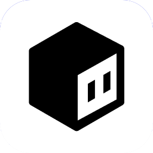</picture> | [Bytebot Desktop](./plugins/plugins/bytebot/) | ✓ | – | – | – | 0.2.0 | Drives a Bytebot desktop (https://github.com/bytebot-ai/bytebot) through `bytebotd`, its local… |
| <picture><source media="(prefers-color-scheme: dark)" srcset="./plugins/plugins/effort-escalator/icon-dark.png" /></picture> | [Effort Escalator](./plugins/plugins/effort-escalator/) | ✓ | – | – | – | 0.2.0 | Detects stalled work with a cheap background judge and moves the next turn up a configured… |
| <picture><source media="(prefers-color-scheme: dark)" srcset="./plugins/plugins/ghost/icon-dark.png" /></picture> | [Ghost](./plugins/plugins/ghost/) | ✓ | ✓ | – | – | 0.2.0 | Desktop automation: 29 screen perception and input control tools. Cross-platform (Windows,… |
| <picture><source media="(prefers-color-scheme: dark)" srcset="./plugins/plugins/pi-subagent/icon-dark.png" /></picture> | [Subagents](./plugins/plugins/pi-subagent/) | ✓ | – | – | – | 0.2.0 | Adds the Task tool to the managed Pi agent, so it can delegate a bounded, context-isolated job… |
| <picture><source media="(prefers-color-scheme: dark)" srcset="./plugins/plugins/usage-pacer/icon-dark.png" /></picture> | [Usage Pacer](./plugins/plugins/usage-pacer/) | ✓ | – | – | – | 0.2.0 | Keeps subscription agents usable for the whole rolling window. It can pace usage down with a… |

### Browsers

| | Plugin | Official | System | Hidden | Layer | Version | What it is |
| --- | --- | --- | --- | --- | --- | --- | --- |
| <picture><source media="(prefers-color-scheme: dark)" srcset="./plugins/plugins/agentbrowser/icon-dark.png" /></picture> | [Agent Browser](./plugins/plugins/agentbrowser/) | ✓ | ✓ | – | – | 0.2.0 | Browser automation via the `agent-browser` CLI's MCP server (https://agent-browser.dev).… |
| <picture><source media="(prefers-color-scheme: dark)" srcset="./plugins/plugins/ego-browser/icon-dark.png" /></picture> | [Ego Browser](./plugins/plugins/ego-browser/) | ✓ | – | – | – | 0.2.0 | Ego lite (https://github.com/citrolabs/ego-lite) as an optional provider for Ryu's swappable… |

### Developer Tools

| | Plugin | Official | System | Hidden | Layer | Version | What it is |
| --- | --- | --- | --- | --- | --- | --- | --- |
| <picture><source media="(prefers-color-scheme: dark)" srcset="./plugins/plugins/agentation/icon-dark.png" /></picture> | [Agentation](./plugins/plugins/agentation/) | ✓ | – | – | – | 0.2.0 | Visual feedback for coding agents. Agentation connects UI annotations from a running web app to… |
| <picture><source media="(prefers-color-scheme: dark)" srcset="./plugins/plugins/agents-md-tail/icon-dark.png" /></picture> | [AGENTS.md Tail](./plugins/plugins/agents-md-tail/) | ✓ | – | – | – | 0.2.0 | Experimental context hook that keeps the active AGENTS.md instructions at the head and repeats… |
| <picture><source media="(prefers-color-scheme: dark)" srcset="./plugins/plugins/docs/icon-dark.png" /></picture> | [Ryu Docs](./plugins/plugins/docs/) | ✓ | ✓ | – | – | 0.2.0 | Read-only MCP access to the Ryu documentation on docs.ryuhq.com — search the docs and pull any… |
| <picture><source media="(prefers-color-scheme: dark)" srcset="./plugins/plugins/dynamic-workflows/icon-dark.png" />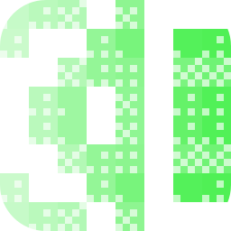</picture> | [dynamic-workflows](./plugins/plugins/dynamic-workflows/) | ✓ | – | – | – | 0.2.0 | Run a validated, bounded fan-out of clean-context delegates. |
| <picture><source media="(prefers-color-scheme: dark)" srcset="./plugins/plugins/expect/icon-dark.png" />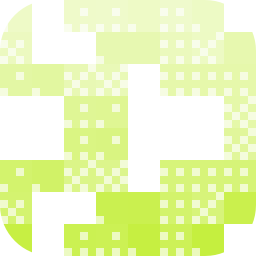</picture> | [Expect](./plugins/plugins/expect/) | ✓ | – | – | – | 0.2.0 | Browser-based QA for agent code. Expect reads the current changes, creates a test plan, and runs… |
| <picture><source media="(prefers-color-scheme: dark)" srcset="./plugins/plugins/headroom/icon-dark.png" />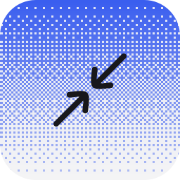</picture> | [Headroom Compression](./plugins/plugins/headroom/) | ✓ | – | – | – | 0.2.0 | Context compression (chopratejas/headroom): compress tool outputs, logs, files, and RAG chunks.… |
| <picture><source media="(prefers-color-scheme: dark)" srcset="./plugins/plugins/hook-observers/icon-dark.png" />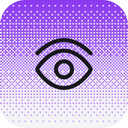</picture> | [Hook Observers](./plugins/plugins/hook-observers/) | ✓ | – | – | – | 0.2.0 | A worked reference for the turn-hook events Ryu can fire: five observer hooks watching… |
| <picture><source media="(prefers-color-scheme: dark)" srcset="./plugins/plugins/hook-session-context/icon-dark.png" /></picture> | [Session Context](./plugins/plugins/hook-session-context/) | ✓ | – | – | – | 0.2.0 | Injects the current date and time at the start of every session, so the agent stops guessing… |
| <picture><source media="(prefers-color-scheme: dark)" srcset="./plugins/plugins/pi-monitor/icon-dark.png" /></picture> | [Monitor](./plugins/plugins/pi-monitor/) | ✓ | – | – | – | 0.2.0 | Adds the monitor tool to the managed Pi agent, so it can watch a command or WebSocket in the… |
| <picture><source media="(prefers-color-scheme: dark)" srcset="./plugins/plugins/pi-shell/icon-dark.png" /></picture> | [Background Bash](./plugins/plugins/pi-shell/) | ✓ | – | – | – | 0.2.0 | Adds bash_background / bash_output / bash_kill to the managed Pi agent, so a long-running… |
| <picture><source media="(prefers-color-scheme: dark)" srcset="./plugins/plugins/pxpipe/icon-dark.png" /></picture> | [pxpipe](./plugins/plugins/pxpipe/) | ✓ | – | – | – | 0.2.0 | Token-saving loopback proxy (https://github.com/teamchong/pxpipe): it renders the bulky, static… |
| <picture><source media="(prefers-color-scheme: dark)" srcset="./plugins/plugins/rtk/icon-dark.png" /></picture> | [RTK (Rust Token Killer)](./plugins/plugins/rtk/) | ✓ | – | – | – | 0.2.0 | Run a dev command through RTK (Rust Token Killer) and get a token-compressed version of its… |
| <picture><source media="(prefers-color-scheme: dark)" srcset="./plugins/plugins/rules/icon-dark.png" /></picture> | [Rules](./plugins/plugins/rules/) | ✓ | – | – | – | 0.2.0 | Discover Cursor- and Claude-style project rules and apply them to agent context, with per-agent… |
| <picture><source media="(prefers-color-scheme: dark)" srcset="./plugins/plugins/sample/icon-dark.png" /></picture> | [Research Assistant](./plugins/plugins/sample/) | ✓ | – | ✓ | – | 0.2.0 | The reference plugin: a minimal example that declares one of each runnable kind — an agent, a… |
| <picture><source media="(prefers-color-scheme: dark)" srcset="./plugins/plugins/sample-widget/icon-dark.png" />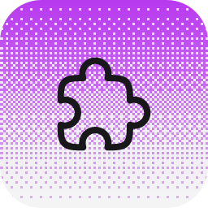</picture> | [Sample Widget](./plugins/plugins/sample-widget/) | ✓ | – | ✓ | – | 0.2.0 | Reference third-party MCP widget plugin. A tiny local Node MCP server (server.mjs) exposes one… |
| <picture><source media="(prefers-color-scheme: dark)" srcset="./plugins/plugins/toolsmith-example/icon-dark.png" />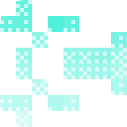</picture> | [toolsmith-example](./plugins/plugins/toolsmith-example/) | ✓ | – | ✓ | – | 0.2.0 | Worked example for tools/toolsmith — a real, verified inline_deno tool. Not registered with Core… |

### Knowledge & Memory

| | Plugin | Official | System | Hidden | Layer | Version | What it is |
| --- | --- | --- | --- | --- | --- | --- | --- |
| <picture><source media="(prefers-color-scheme: dark)" srcset="./plugins/plugins/honcho/icon-dark.png" />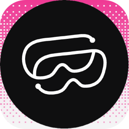</picture> | [Honcho](./plugins/plugins/honcho/) | ✓ | – | – | – | 0.2.0 | Give the swappable `memory` layer a provider that MODELS the user instead of only storing rows,… |
| <picture><source media="(prefers-color-scheme: dark)" srcset="./plugins/plugins/mem0/icon-dark.png" />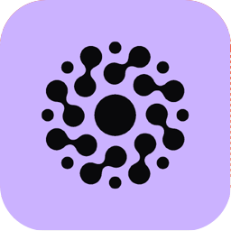</picture> | [Mem0](./plugins/plugins/mem0/) | ✓ | – | – | – | 0.2.0 | Read and write a hosted Mem0 memory project (https://mem0.ai) through the Mem0 Platform REST… |
| <picture><source media="(prefers-color-scheme: dark)" srcset="./plugins/plugins/no-more-mistakes/icon-dark.png" /></picture> | [No More Mistakes](./plugins/plugins/no-more-mistakes/) | ✓ | – | – | – | 0.2.0 | Notices when you correct the agent, writes the lesson down as a one-line rule in a Space, and… |
| <picture><source media="(prefers-color-scheme: dark)" srcset="./plugins/plugins/shadow/icon-dark.png" />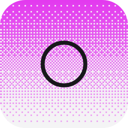</picture> | [Shadow](./plugins/plugins/shadow/) | ✓ | ✓ | – | – | 0.2.0 | Search everything Shadow has captured (screen text, audio transcripts, input) and summarize… |

### Models

| | Plugin | Official | System | Hidden | Layer | Version | What it is |
| --- | --- | --- | --- | --- | --- | --- | --- |
| <picture><source media="(prefers-color-scheme: dark)" srcset="./plugins/plugins/chatgpt-web/icon-dark.png" /></picture> | [ChatGPT Web](./plugins/plugins/chatgpt-web/) | ✓ | – | – | – | 0.2.0 | Use a ChatGPT Web subscription through Ryu's signed-in Browser app as an OpenAI-compatible model… |

### Productivity

| | Plugin | Official | System | Hidden | Layer | Version | What it is |
| --- | --- | --- | --- | --- | --- | --- | --- |
| <picture><source media="(prefers-color-scheme: dark)" srcset="./plugins/plugins/action-summary/icon-dark.png" /></picture> | [Action Summary](./plugins/plugins/action-summary/) | ✓ | – | – | – | 0.2.0 | Explains streamed thinking blocks and tool calls in one plain-language line per action, using a… |
| <picture><source media="(prefers-color-scheme: dark)" srcset="./plugins/plugins/ambient-elevator/icon-dark.png" /></picture> | [Ambient Elevator](./plugins/plugins/ambient-elevator/) | ✓ | – | – | – | 0.2.0 | Plays one low-volume elevator track while any Ryu agent is actively working, then stops when the… |
| <picture><source media="(prefers-color-scheme: dark)" srcset="./plugins/plugins/auto-continue/icon-dark.png" />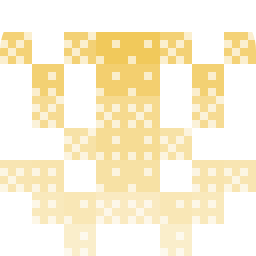</picture> | [Auto Continue](./plugins/plugins/auto-continue/) | ✓ | – | – | – | 0.2.0 | After each turn while armed, a local sub-agent scans the reply and the workspace for work that… |
| <picture><source media="(prefers-color-scheme: dark)" srcset="./plugins/plugins/chat-title/icon-dark.png" />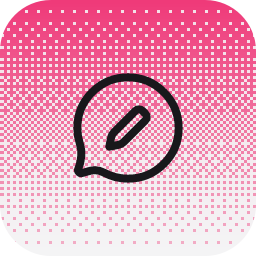</picture> | [Chat Title](./plugins/plugins/chat-title/) | ✓ | – | – | – | 0.2.0 | Auto-renames a chat as soon as the first reply lands, then again after every N completed… |
| <picture><source media="(prefers-color-scheme: dark)" srcset="./plugins/plugins/expanded-composer/icon-dark.png" /></picture> | [Expanded Composer](./plugins/plugins/expanded-composer/) | ✓ | – | – | – | 0.2.0 | Expand the current chat composer in place while keeping the same draft, attachments, and send… |
| <picture><source media="(prefers-color-scheme: dark)" srcset="./plugins/plugins/ghost-chats/icon-dark.png" /></picture> | [Temporary Chats](./plugins/plugins/ghost-chats/) | ✓ | – | – | – | 0.2.0 | Start a private temporary chat that stays in the current tab and leaves no conversation history,… |
| <picture><source media="(prefers-color-scheme: dark)" srcset="./plugins/plugins/goal/icon-dark.png" /></picture> | [Goal](./plugins/plugins/goal/) | ✓ | – | – | – | 0.2.0 | Give the agent a goal with `/goal` or let an agent set one with `goal.set`; it keeps working… |
| <picture><source media="(prefers-color-scheme: dark)" srcset="./plugins/plugins/no-ai-slop/icon-dark.png" /></picture> | [No AI Slop](./plugins/plugins/no-ai-slop/) | ✓ | – | – | – | 0.2.0 | Bundles the `no-ai-slop` editing skill and runs it on every finished answer: a separate reviewer… |
| <picture><source media="(prefers-color-scheme: dark)" srcset="./plugins/plugins/output-styles/icon-dark.png" /></picture> | [Output Styles](./plugins/plugins/output-styles/) | ✓ | – | – | – | 0.2.0 | The ten built-in output styles — ELI5, I have ADHD, Explanatory, Learning, Proactive, Plain… |
| <picture><source media="(prefers-color-scheme: dark)" srcset="./plugins/plugins/plan-continue/icon-dark.png" /></picture> | [Plan Continue](./plugins/plugins/plan-continue/) | ✓ | – | – | – | 0.2.0 | While plan mode is on and the plan has not been accepted, this injects a follow-up turn after… |
| <picture><source media="(prefers-color-scheme: dark)" srcset="./plugins/plugins/prompt-suggestions/icon-dark.png" /></picture> | [Prompt Suggestions](./plugins/plugins/prompt-suggestions/) | ✓ | – | – | – | 0.2.0 | Fast next-prompt suggestions in the chat composer, generated by a lightweight side agent from… |
| <picture><source media="(prefers-color-scheme: dark)" srcset="./plugins/plugins/reactions/icon-dark.png" /></picture> | [Message Reactions](./plugins/plugins/reactions/) | ✓ | – | – | – | 0.2.0 | Adds emoji reactions to persisted chat messages through the shared message-action contribution… |
| <picture><source media="(prefers-color-scheme: dark)" srcset="./plugins/plugins/recap/icon-dark.png" /></picture> | [Recap](./plugins/plugins/recap/) | ✓ | – | – | – | 0.2.0 | Ends a long agent turn with a short recap of what it actually did — the work, the files and… |
| <picture><source media="(prefers-color-scheme: dark)" srcset="./plugins/plugins/reconnect-retry/icon-dark.png" /></picture> | [Reconnect Retry](./plugins/plugins/reconnect-retry/) | ✓ | – | – | – | 0.2.0 | Remember chats that were running when the selected node or network went away, then retry each… |
| <picture><source media="(prefers-color-scheme: dark)" srcset="./plugins/plugins/side-chats/icon-dark.png" /></picture> | [Side Chats](./plugins/plugins/side-chats/) | ✓ | – | – | – | 0.2.0 | Ask focused questions about the current conversation without adding another turn to the main… |
| <picture><source media="(prefers-color-scheme: dark)" srcset="./plugins/plugins/tokenmaxxing/icon-dark.png" /></picture> | [Tokenmaxxing](./plugins/plugins/tokenmaxxing/) | ✓ | – | – | – | 0.2.0 | Opt-in notification when all delegated agents finish. |

### Research

| | Plugin | Official | System | Hidden | Layer | Version | What it is |
| --- | --- | --- | --- | --- | --- | --- | --- |
| <picture><source media="(prefers-color-scheme: dark)" srcset="./plugins/plugins/advisor/icon-dark.png" /></picture> | [Advisor](./plugins/plugins/advisor/) | ✓ | – | – | – | 0.2.0 | Consult a stronger reviewer model for a second opinion — as an auto-review turn hook (toggle /… |

### Search

| | Plugin | Official | System | Hidden | Layer | Version | What it is |
| --- | --- | --- | --- | --- | --- | --- | --- |
| <picture><source media="(prefers-color-scheme: dark)" srcset="./plugins/plugins/brave/icon-dark.png" /></picture> | [Brave Search](./plugins/plugins/brave/) | ✓ | – | – | – | 0.2.0 | Independent web search via the Brave Search API (https://brave.com/search/api/), exposed as one… |
| <picture><source media="(prefers-color-scheme: dark)" srcset="./plugins/plugins/exa/icon-dark.png" />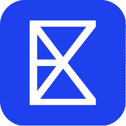</picture> | [Exa Search](./plugins/plugins/exa/) | ✓ | – | – | – | 0.2.0 | Neural and keyword web search via the Exa API (https://exa.ai), exposed as two declarative HTTP… |
| <picture><source media="(prefers-color-scheme: dark)" srcset="./plugins/plugins/firecrawl/icon-dark.png" /></picture> | [Firecrawl](./plugins/plugins/firecrawl/) | ✓ | – | – | – | 0.2.0 | Web search and page scraping via the Firecrawl v2 API (https://firecrawl.dev), exposed as two… |
| <picture><source media="(prefers-color-scheme: dark)" srcset="./plugins/plugins/parallel/icon-dark.png" /></picture> | [Parallel Search](./plugins/plugins/parallel/) | ✓ | – | – | – | 0.2.0 | Web search and content extraction via Parallel (https://parallel.ai), exposed as three… |
| <picture><source media="(prefers-color-scheme: dark)" srcset="./plugins/plugins/scrapling/icon-dark.png" /></picture> | [Scrapling](./plugins/plugins/scrapling/) | ✓ | – | – | – | 0.2.0 | Adaptive web-page extraction via the Scrapling MCP server (https://scrapling.readthedocs.io), a… |
| <picture><source media="(prefers-color-scheme: dark)" srcset="./plugins/plugins/serper/icon-dark.png" /></picture> | [Serper](./plugins/plugins/serper/) | ✓ | – | – | – | 0.2.0 | Google's own search results as JSON via the Serper API (https://serper.dev), plus single-page… |
| <picture><source media="(prefers-color-scheme: dark)" srcset="./plugins/plugins/spider/icon-dark.png" /></picture> | [Spider](./plugins/plugins/spider/) | ✓ | – | – | – | 0.2.0 | High-performance web crawling and content extraction via the Spider CLI (https://spider.cloud),… |
| <picture><source media="(prefers-color-scheme: dark)" srcset="./plugins/plugins/spidercloud/icon-dark.png" /></picture> | [Spider Cloud](./plugins/plugins/spidercloud/) | ✓ | – | – | – | 0.2.0 | Hosted multi-page web crawling via the Spider Cloud API (https://spider.cloud), exposed as one… |
| <picture><source media="(prefers-color-scheme: dark)" srcset="./plugins/plugins/tavily/icon-dark.png" /></picture> | [Tavily Search](./plugins/plugins/tavily/) | ✓ | – | – | – | 0.2.0 | Search-and-extract for agents via the Tavily API (https://tavily.com), exposed as two… |

### Security

| | Plugin | Official | System | Hidden | Layer | Version | What it is |
| --- | --- | --- | --- | --- | --- | --- | --- |
| <picture><source media="(prefers-color-scheme: dark)" srcset="./plugins/plugins/bitwarden/icon-dark.png" /></picture> | [Bitwarden Secrets Manager](./plugins/plugins/bitwarden/) | ✓ | – | – | – | 0.2.0 | Pull API keys from Bitwarden Secrets Manager on demand instead of storing them in plaintext —… |
| <picture><source media="(prefers-color-scheme: dark)" srcset="./plugins/plugins/double-check/icon-dark.png" /></picture> | [Double Check](./plugins/plugins/double-check/) | ✓ | – | – | – | 0.2.0 | Sends every answer to a second model for review before you act on it, so mistakes get caught by… |
| <picture><source media="(prefers-color-scheme: dark)" srcset="./plugins/plugins/firewall/icon-dark.png" />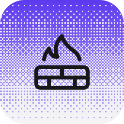</picture> | [Gateway Firewall](./plugins/plugins/firewall/) | ✓ | – | – | – | 0.2.0 | An on/off switch over the Gateway's built-in firewall, which screens model traffic for prompt… |
| <picture><source media="(prefers-color-scheme: dark)" srcset="./plugins/plugins/observer-agents/icon-dark.png" />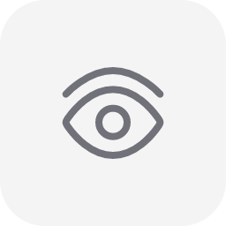</picture> | [Observer Agents](./plugins/plugins/observer-agents/) | ✓ | – | – | – | 0.2.0 | Adds an opt-in background reviewer that watches the latest agent activity and sends concise… |
| <picture><source media="(prefers-color-scheme: dark)" srcset="./plugins/plugins/proof/icon-dark.png" /></picture> | [Proof of Work](./plugins/plugins/proof/) | ✓ | – | – | – | 0.2.0 | The stricter sibling of `/goal`: an independent verifier agent has to prove with tool-gathered… |
| <picture><source media="(prefers-color-scheme: dark)" srcset="./plugins/plugins/receipts/icon-dark.png" /></picture> | [Receipts](./plugins/plugins/receipts/) | ✓ | – | – | – | 0.2.0 | Verify work with visual evidence: `/receipt <goal>` makes the agent capture a screenshot or… |
| <picture><source media="(prefers-color-scheme: dark)" srcset="./plugins/plugins/security-guidance/icon-dark.png" /></picture> | [Security Guidance](./plugins/plugins/security-guidance/) | ✓ | – | – | – | 0.2.0 | Scans each answer for security vulnerabilities and has a second model review the code before you… |
| <picture><source media="(prefers-color-scheme: dark)" srcset="./plugins/plugins/security-scanner/icon-dark.png" />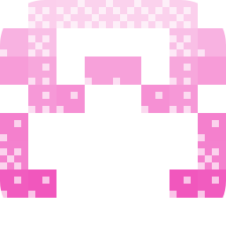</picture> | [Security Scanner](./plugins/plugins/security-scanner/) | ✓ | – | – | – | 0.2.0 | A model-agnostic security workbench for Ryu: map the architecture, hunt for vulnerabilities,… |
| <picture><source media="(prefers-color-scheme: dark)" srcset="./plugins/plugins/tool-firewall/icon-dark.png" /></picture> | [Tool Firewall](./plugins/plugins/tool-firewall/) | ✓ | – | – | – | 0.2.0 | A worked reference for pre- and post-tool hooks: the pre hook denies any tool call whose input… |

### LSP

| | Plugin | Official | System | Hidden | Layer | Version | What it is |
| --- | --- | --- | --- | --- | --- | --- | --- |
| <picture><source media="(prefers-color-scheme: dark)" srcset="./plugins/lsp/clangd-lsp/icon-dark.png" /></picture> | [Clangd (C/C++)](./plugins/lsp/clangd-lsp/) | ✓ | – | – | – | 0.2.0 | C/C++ language server (clangd) for the ryu agent: definitions, references, hover, symbols,… |
| <picture><source media="(prefers-color-scheme: dark)" srcset="./plugins/lsp/csharp-lsp/icon-dark.png" /></picture> | [C# LSP](./plugins/lsp/csharp-lsp/) | ✓ | – | – | – | 0.2.0 | C# language server (csharp-ls) for the ryu agent: definitions, references, hover, symbols,… |
| <picture><source media="(prefers-color-scheme: dark)" srcset="./plugins/lsp/gopls-lsp/icon-dark.png" />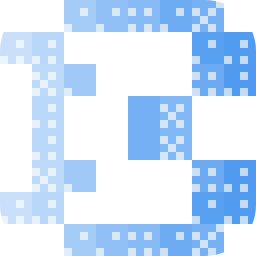</picture> | [Go LSP](./plugins/lsp/gopls-lsp/) | ✓ | – | – | – | 0.2.0 | Go language server (gopls) for the ryu agent: definitions, references, hover, symbols,… |
| <picture><source media="(prefers-color-scheme: dark)" srcset="./plugins/lsp/jdtls-lsp/icon-dark.png" />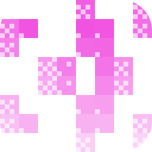</picture> | [Java LSP](./plugins/lsp/jdtls-lsp/) | ✓ | – | – | – | 0.2.0 | Java language server (Eclipse JDT.LS) for the ryu agent: definitions, references, hover,… |
| <picture><source media="(prefers-color-scheme: dark)" srcset="./plugins/lsp/kotlin-lsp/icon-dark.png" /></picture> | [Kotlin LSP](./plugins/lsp/kotlin-lsp/) | ✓ | – | – | – | 0.2.0 | Kotlin language server for the ryu agent: definitions, references, hover, symbols,… |
| <picture><source media="(prefers-color-scheme: dark)" srcset="./plugins/lsp/lua-lsp/icon-dark.png" />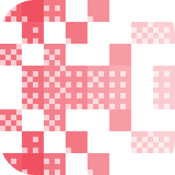</picture> | [Lua LSP](./plugins/lsp/lua-lsp/) | ✓ | – | – | – | 0.2.0 | Lua language server (lua-language-server) for the ryu agent: definitions, references, hover,… |
| <picture><source media="(prefers-color-scheme: dark)" srcset="./plugins/lsp/php-lsp/icon-dark.png" /></picture> | [PHP LSP](./plugins/lsp/php-lsp/) | ✓ | – | – | – | 0.2.0 | PHP language server (Intelephense) for the ryu agent: definitions, references, hover, symbols,… |
| <picture><source media="(prefers-color-scheme: dark)" srcset="./plugins/lsp/pyright-lsp/icon-dark.png" />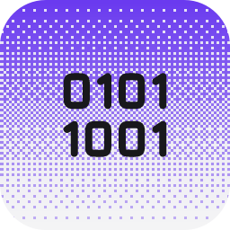</picture> | [Python LSP](./plugins/lsp/pyright-lsp/) | ✓ | – | – | – | 0.2.0 | Python language server (Pyright) for the ryu agent: type checking plus definitions, references,… |
| <picture><source media="(prefers-color-scheme: dark)" srcset="./plugins/lsp/ruby-lsp/icon-dark.png" /></picture> | [Ruby LSP](./plugins/lsp/ruby-lsp/) | ✓ | – | – | – | 0.2.0 | Ruby language server (ruby-lsp) for the ryu agent: definitions, references, hover, symbols,… |
| <picture><source media="(prefers-color-scheme: dark)" srcset="./plugins/lsp/rust-analyzer-lsp/icon-dark.png" />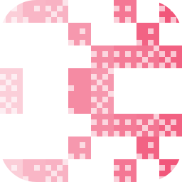</picture> | [Rust LSP](./plugins/lsp/rust-analyzer-lsp/) | ✓ | – | – | – | 0.2.0 | Rust language server (rust-analyzer) for the ryu agent: definitions, references, hover, symbols,… |
| <picture><source media="(prefers-color-scheme: dark)" srcset="./plugins/lsp/swift-lsp/icon-dark.png" /></picture> | [Swift LSP](./plugins/lsp/swift-lsp/) | ✓ | – | – | – | 0.2.0 | Swift language server (SourceKit-LSP) for the ryu agent: definitions, references, hover,… |
| <picture><source media="(prefers-color-scheme: dark)" srcset="./plugins/lsp/typescript-lsp/icon-dark.png" /></picture> | [TypeScript & JavaScript LSP](./plugins/lsp/typescript-lsp/) | ✓ | – | – | – | 0.2.0 | TypeScript/JavaScript language server for the ryu agent: definitions, references, hover,… |

## External plugins (2)

Hosted providers that connect Ryu's swappable layers to an outside service.

### Browsers

| | Plugin | External | Layer | Version | What it is |
| --- | --- | --- | --- | --- |
| <picture><source media="(prefers-color-scheme: dark)" srcset="./plugins/external_plugins/cloudflare-browser-run/icon-dark.png" /></picture> | [Cloudflare Browser Run](./plugins/external_plugins/cloudflare-browser-run/) | ✓ | – | 0.2.0 | Hosted Browser Run quick actions over Cloudflare's remote OAuth MCP server. Adds URL-scoped… |

### Productivity

| | Plugin | External | Layer | Version | What it is |
| --- | --- | --- | --- | --- |
| <picture><source media="(prefers-color-scheme: dark)" srcset="./plugins/external_plugins/composio-connect/icon-dark.png" /></picture> | [Composio Connect](./plugins/external_plugins/composio-connect/) | ✓ | – | 0.2.0 | Connect Ryu to Composio's hosted For You MCP server with OAuth. The connection exposes… |

## Portable packages (19)

Every package is an editable folder and can also be packed as a deterministic `.ryupack` archive.

### Creative

| Package | Version | Checksum | What it is |
| --- | --- | --- | --- |
| [animator](./agents/animator/) | 0.2.0 | `fc0820e82b34…` | Expert animation director and creative technologist for technical explainers, data… |

### Design

| Package | Version | Checksum | What it is |
| --- | --- | --- | --- |
| [design-director](./agents/design-director/) | 0.2.0 | `236cbf917743…` | Expert product design director and design engineer for UI/UX, responsive systems, motion,… |

### Marketing

| Package | Version | Checksum | What it is |
| --- | --- | --- | --- |
| [brand-presence](./agents/brand-presence/) | 0.2.0 | `63d8f5cd18de…` | Starts with a brand presence check and monitors the public web for new mentions, sentiment, and… |
| [marketing-studio](./agents/marketing-studio/) | 0.2.0 | `4350e8c3b77c…` | Generates on-brand marketing content and production-ready visual directions with Hyperframes and… |

### Monitoring

| Package | Version | Checksum | What it is |
| --- | --- | --- | --- |
| [codex-quota-reset-watch](./agents/codex-quota-reset-watch/) | 0.2.0 | `b493eb6045aa…` | Checks willcodexquotareset.com every 30 minutes, remembers the last forecast, and sends a… |

### Operations

| Package | Version | Checksum | What it is |
| --- | --- | --- | --- |
| [expiry-date-tracker](./agents/expiry-date-tracker/) | 0.2.0 | `6b313aeafb8e…` | Reviews the dates in your connected documents and Spaces, then calls out what is expiring soon… |

### Security

| Package | Version | Checksum | What it is |
| --- | --- | --- | --- |
| [security-guard](./agents/security-guard/) | 0.2.0 | `444b5c1f0fe2…` | Runs a fast hourly configuration check and a deeper midnight diagnostic pass over Gateway and… |

### orchestration

| Package | Version | Checksum | What it is |
| --- | --- | --- | --- |
| [autonomous-agent](./workflows/autonomous-agent/) | 0.2.0 | `adf9fb2d73f1…` | A tool-using agent runs its own loop, wrapped in a bounded durable loop until it is done. |
| [classify-and-act](./workflows/classify-and-act/) | 0.2.0 | `c5abdced5b20…` | Classify the request, then hand it to a specialized agent per class. |
| [orchestrator-workers](./workflows/orchestrator-workers/) | 0.2.0 | `b4e3ec216ba2…` | An orchestrator LLM plans subtasks, delegates them to workers, then integrates the results. |
| [parallelization](./workflows/parallelization/) | 0.2.0 | `13120f52b734…` | Fan the task out to independent clean-context workers, then synthesize their results. |
| [prompt-chaining](./workflows/prompt-chaining/) | 0.2.0 | `e0bad33f3f86…` | Decompose a task into a fixed sequence of LLM steps, each feeding the next (outline → draft →… |
| [routing](./workflows/routing/) | 0.2.0 | `9d910c1ae021…` | Classify the input, then branch to the specialized handler for that class. |

### quality

| Package | Version | Checksum | What it is |
| --- | --- | --- | --- |
| [adversarial-verification](./workflows/adversarial-verification/) | 0.2.0 | `98a0728badf8…` | Generate an answer, have N independent verifiers vote, and accept on majority — else revise. |
| [evaluator-optimizer](./workflows/evaluator-optimizer/) | 0.2.0 | `c24555b182c6…` | Generate a draft, then iteratively critique and rewrite it over several bounded passes. |
| [fan-out-synthesize](./workflows/fan-out-synthesize/) | 0.2.0 | `2748d5502582…` | Fan work out over items to independent sub-agents, then merge their outputs into one result. |
| [generate-and-filter](./workflows/generate-and-filter/) | 0.2.0 | `eb447ce349b6…` | Generate N proposals in parallel, then score and select the best. |
| [tournament](./workflows/tournament/) | 0.2.0 | `d24a5d64430f…` | Generate N candidates in parallel, then pick a winner by pairwise comparison. |

### research

| Package | Version | Checksum | What it is |
| --- | --- | --- | --- |
| [autoresearch](./workflows/autoresearch/) | 0.2.0 | `683b409e3bce…` | Requires the Research app (@ryu/research) to be enabled — it provides the research__* tools this… |

