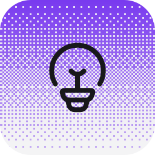
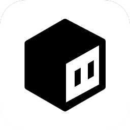
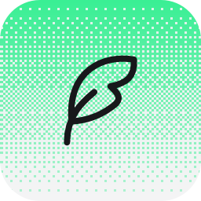
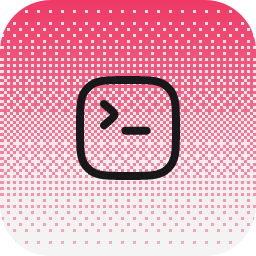
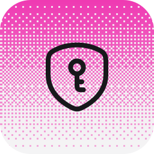
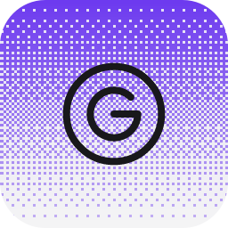
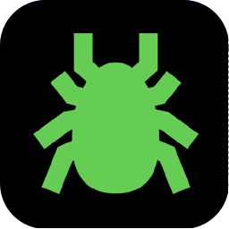

# Ryu Marketplace

The catalog for **Ryu apps and plugins**.

- `.ryu-plugin/marketplace.json` — the generated index. It lists **both**
  tiers: `type: "app"` (apps-store apps, which ship from their own
  `amajorai/ryu-<app>` satellite repos) and `type: "plugin"` (declarative,
  UI-less plugins, whose source is carried here).
- `plugins/<name>/manifest.json` — the source-of-truth manifest for each
  first-party plugin. A declarative plugin IS its manifest.
- `schema/marketplace.schema.json` — the index schema.

This tree is a ONE-WAY mirror generated from the private monorepo by
`tools/mirror-plugins.sh`; do not edit it here (changes are overwritten —
edit the generator instead).

## Third-party listings (GitHub topic discovery)

Third-party apps and plugins are discovered automatically from GitHub
topics — add **`ryu-app`** or **`ryu-plugin`** to your repository and it
becomes discoverable in the Ryu marketplace (desktop + web).

> Listings discovered by topic are **not reviewed** by Ryu. Install at
> your own discretion — read the manifest, check what permission grants
> it requests, and prefer repos you can audit.

## First-party plugins (40)

| | Plugin | What it is |
| --- | --- | --- |
|  | [`advisor`](./plugins/advisor/) | Consult a stronger reviewer model for a second opinion — as an auto-review turn hook (toggle /… |
|  | [`agent-comms`](./plugins/agent-comms/) | Lets the agents on this node talk to each other. Any agent can look up who else is here, leave… |
|  | [`agentbrowser`](./plugins/agentbrowser/) | Browser automation via the `agent-browser` CLI's MCP server (https://agent-browser.dev).… |
|  | [`brave`](./plugins/brave/) | Independent web search via the Brave Search API (https://brave.com/search/api/), exposed as one… |
|  | [`bytebot`](./plugins/bytebot/) | Drives a Bytebot desktop (https://github.com/bytebot-ai/bytebot) through `bytebotd`, its local… |
|  | [`chat-title`](./plugins/chat-title/) | Auto-renames a chat as soon as the first reply lands, then again after every N completed… |
|  | [`double-check`](./plugins/double-check/) | Sends every answer to a second model for review before you act on it, so mistakes get caught by… |
|  | [`exa`](./plugins/exa/) | Neural and keyword web search via the Exa API (https://exa.ai), exposed as two declarative HTTP… |
|  | [`firecrawl`](./plugins/firecrawl/) | Web search and page scraping via the Firecrawl v2 API (https://firecrawl.dev), exposed as two… |
|  | [`firewall`](./plugins/firewall/) | An on/off switch over the Gateway's built-in firewall, which screens model traffic for prompt… |
|  | [`ghost`](./plugins/ghost/) | Desktop automation: 29 screen perception and input control tools. Cross-platform (Windows,… |
|  | [`goal`](./plugins/goal/) | Give the agent a goal with `/goal` and it keeps working until a judge model agrees the goal is… |
|  | [`headroom`](./plugins/headroom/) | Context compression (chopratejas/headroom): compress tool outputs, logs, files, and RAG chunks.… |
|  | [`honcho`](./plugins/honcho/) | Give the swappable `memory` layer a provider that MODELS the user instead of only storing rows,… |
|  | [`hook-observers`](./plugins/hook-observers/) | A worked reference for the turn-hook events Ryu can fire: five observer hooks watching… |
|  | [`hook-session-context`](./plugins/hook-session-context/) | Injects the current date and time at the start of every session, so the agent stops guessing… |
|  | [`mem0`](./plugins/mem0/) | Read and write a hosted Mem0 memory project (https://mem0.ai) through the Mem0 Platform REST… |
|  | [`no-ai-slop`](./plugins/no-ai-slop/) | Bundles the `no-ai-slop` editing skill and runs it on every finished answer: a separate reviewer… |
|  | [`no-more-mistakes`](./plugins/no-more-mistakes/) | Notices when you correct the agent, writes the lesson down as a one-line rule in a Space, and… |
|  | [`output-styles`](./plugins/output-styles/) | The nine built-in output styles — ELI5, I have ADHD, Explanatory, Learning, Proactive, Plain… |
|  | [`parallel`](./plugins/parallel/) | Web search and content extraction via Parallel (https://parallel.ai), exposed as three… |
|  | [`pi-shell`](./plugins/pi-shell/) | Adds bash_background / bash_output / bash_kill to the managed Pi agent, so a long-running… |
|  | [`pi-subagent`](./plugins/pi-subagent/) | Adds the Task tool to the managed Pi agent, so it can delegate a bounded, context-isolated job… |
|  | [`plan-continue`](./plugins/plan-continue/) | While plan mode is on and the plan has not been accepted, this injects a follow-up turn after… |
|  | [`proof`](./plugins/proof/) | The stricter sibling of `/goal`: an independent verifier agent has to prove with tool-gathered… |
|  | [`pxpipe`](./plugins/pxpipe/) | Token-saving loopback proxy (https://github.com/teamchong/pxpipe): it renders the bulky, static… |
|  | [`recap`](./plugins/recap/) | Ends a long agent turn with a short recap of what it actually did — the work, the files and… |
|  | [`receipts`](./plugins/receipts/) | Verify work with visual evidence: `/receipt <goal>` makes the agent capture a screenshot or… |
|  | [`rtk`](./plugins/rtk/) | Run a dev command through RTK (Rust Token Killer) and get a token-compressed version of its… |
|  | [`sample`](./plugins/sample/) | The reference plugin: a minimal example that declares one of each runnable kind — an agent, a… |
|  | [`sample-widget`](./plugins/sample-widget/) | Reference third-party MCP widget plugin. A tiny local Node MCP server (server.mjs) exposes one… |
|  | [`scrapling`](./plugins/scrapling/) | Adaptive web-page extraction via the Scrapling MCP server (https://scrapling.readthedocs.io), a… |
|  | [`security-guidance`](./plugins/security-guidance/) | Scans each answer for security vulnerabilities and has a second model review the code before you… |
|  | [`serper`](./plugins/serper/) | Google's own search results as JSON via the Serper API (https://serper.dev), plus single-page… |
|  | [`shadow`](./plugins/shadow/) | Search everything Shadow has captured (screen text, audio transcripts, input) and summarize… |
|  | [`spider`](./plugins/spider/) | High-performance web crawling and content extraction via the Spider CLI (https://spider.cloud),… |
|  | [`spidercloud`](./plugins/spidercloud/) | Hosted multi-page web crawling via the Spider Cloud API (https://spider.cloud), exposed as one… |
|  | [`tavily`](./plugins/tavily/) | Search-and-extract for agents via the Tavily API (https://tavily.com), exposed as two… |
|  | [`tool-firewall`](./plugins/tool-firewall/) | A worked reference for pre- and post-tool hooks: the pre hook denies any tool call whose input… |
|  | [`toolsmith-example`](./plugins/toolsmith-example/) | Worked example for tools/toolsmith — a real, verified inline_deno tool. Not registered with Core… |
