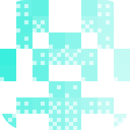

# Agentation
<p align="center">
  <picture>
    <source media="(prefers-color-scheme: dark)" srcset="./icon-dark.png" />
    
  </picture>
</p>

[Agentation](https://www.agentation.com/) turns UI annotations into structured
feedback an agent can act on. Its toolbar records the selected element, source
location, component context, computed styles, and the user's request; the MCP
server lets an agent read and update that feedback without copy-paste.

Ryu ships the plugin enabled by default. Core launches the local server lazily
as:

```bash
npx -y agentation-mcp server
```

Node.js is required. Add the `Agentation` toolbar to the web app being reviewed
and connect it to the server's default port (`4747`) before asking an agent to
read annotations. Tools appear under the `agentation__` namespace. Disable the
plugin from the App store if the local annotation bridge is not wanted.
