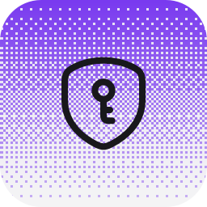

# Bitwarden Secrets Manager
<p align="center">
  <picture>
    <source media="(prefers-color-scheme: dark)" srcset="./icon-dark.png" />
    
  </picture>
</p>

Pull API keys from [Bitwarden Secrets Manager](https://bitwarden.com/products/secrets-manager/)
on demand instead of storing them in plaintext in config or env. One bootstrap
secret — a machine-account access token — replaces N provider keys, and rotating
a credential becomes a single change in the Bitwarden web app.

This is a faithful port of Hermes's `hermes secrets bitwarden` feature onto Ryu's
plugin substrate: a fully declarative plugin of `command`-backend tools that shell
out to the locally-installed `bws` CLI (BYO binary, no API key in the manifest).
The access token is never written to disk by the plugin — the `bws` CLI reads it
from the environment, and Core passes it through to the child process as
`BWS_ACCESS_TOKEN` (values are excluded from the firewall/DLP scan and the audit).

## Tools

| Tool id                    | Backend                      | Required args   |
| -------------------------- | ---------------------------- | --------------- |
| `bitwarden__status`   | `command` → local `bws`       | —               |
| `bitwarden__projects` | `command` → local `bws`       | —               |
| `bitwarden__list`     | `command` → local `bws`       | `project_id`    |
| `bitwarden__get`      | `command` → local `bws`       | `secret_id`     |

- `bitwarden__status` — `bws --version`. Confirms the CLI is installed before any
  other call (no token needed).
- `bitwarden__projects` — `bws project list`. Lists the projects the machine
  account can read, returning `{ id, name }` — discover a `project_id` here.
- `bitwarden__list` — `bws secret list <project_id>`. Returns every secret in a
  project as `{ id, key, value, note, projectId }`. This is the "pull my keys"
  operation: the agent reads a credential from Bitwarden instead of it living in
  config.
- `bitwarden__get` — `bws secret get <secret_id>`. Fetches one secret by its
  Bitwarden id.

All four run under a 60s wall-clock timeout; the list/get/projects commands parse
stdout as JSON (`bws`'s default output format).

## Setup

### 1. Create a machine account and access token

In the [Bitwarden web app](https://vault.bitwarden.com) (or `vault.bitwarden.eu`):

1. Switch to **Secrets Manager** from the product switcher.
2. Create or pick a **Project** (e.g. "My keys"). Add your provider keys as
   secrets; the secret **Name** becomes the key the agent reads (e.g.
   `OPENROUTER_API_KEY`).
3. **Machine accounts → New machine account** → grant **Read** access to the
   project.
4. **Access tokens → Create access token** → copy the token (starts with `0.`).
   Bitwarden cannot retrieve it again — keep the copy.

### 2. Put the token in Core's environment

The `bws` CLI reads the machine-account token from `BWS_ACCESS_TOKEN` (this is
Hermes's `access_token_env` / `.env` convention, kept verbatim so an existing
Hermes setup is reusable):

```bash
export BWS_ACCESS_TOKEN="0.…"        # the machine-account access token
# optional, for EU Cloud / self-hosted (empty = US Cloud, the bws default):
export BWS_SERVER_URL="https://vault.bitwarden.eu"
```

Core passes both through to the `bws` child via the tool's `command_env`; they are
never part of the model-visible input schema.

### 3. Install and allowlist the `bws` CLI

`bws` is a local CLI, not a bundled binary. Install it from the
[bitwarden/sdk-sm releases](https://github.com/bitwarden/sdk-sm/releases) and
place the binary at `~/.ryu/bin/bws` (the built-in allowlist seed), or point Core
at it explicitly:

```bash
# built-in seed location (no extra config):
cp bws ~/.ryu/bin/bws
# or via the KEY=abs-path allowlist override:
export RYU_COMMAND_TOOL_ALLOWLIST="bws=$(command -v bws)"
# or a one-off bin override:
export RYU_BWS_BIN="$(command -v bws)"
```

Until the binary is present, a call resolves as "not installed" (`{available:
false, reason, hint}`) so the agent's turn continues — the same graceful
degradation as a missing `spider`/`rtk`.

## Security

- **The bootstrap token is the credential.** Anyone with `BWS_ACCESS_TOKEN` can
  read every secret the machine account can access. Treat it like any API key —
  revoke + regenerate from the Bitwarden web app if it leaks.
- **No token in the manifest or the audit.** The token travels only as
  `command_env` (an `env:` source resolved server-side); declared env VALUES are
  deliberately excluded from the firewall/DLP scan and the audit trail.
- **Rotate once, every call picks it up.** Because secrets are pulled live on
  each tool call (not cached in config), a credential rotated in Bitwarden is
  already the value the next call returns.
- **No shell.** The `bws` argv is built as an argv array (never `sh -c`), so
  interpolated values cannot smuggle shell metacharacters. Every call is
  grant-gated (`tool:command:bws`) and runs through the same Gateway budget +
  exec-approval scan as the other command tools.

## When NOT to use this

- Single-machine personal setups where plaintext env is fine — you are trading one
  credential for another and adding a network dependency.
- Air-gapped environments that cannot reach `api.bitwarden.com`.
- CI/CD where an existing secrets-injection mechanism (GitHub Actions secrets,
  Vault, etc.) is already set up — pick one path, not two.

The good case is multi-machine fleets, shared dev boxes, gateway VPSes, or any
setup that wants centralized rotation and revocation across several installs.

Definition lives in `manifest.json` (compiled into Core from this package
directory); published to `ryu-marketplace` via `tools/mirror-plugins.sh`.
