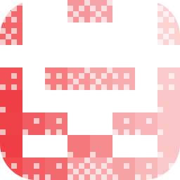

# ChatGPT Web for Ryu

  <picture>
    <source media="(prefers-color-scheme: dark)" srcset="./icon-dark.png" />
    
  </picture>

This plugin exposes a ChatGPT Web subscription as an OpenAI-compatible Ryu model provider. It uses the Ryu Browser app as the browser boundary:

1. Ryu opens `chatgpt.com/?temporary-chat=true` in the signed-in Ryu Browser.
2. The sidecar selects Instant, Medium, High, Extra High, or Pro through the page's accessibility tree.
3. It submits the conversation and returns the visible answer through `/v1/chat/completions`.

It does not modify the Codex desktop app, read browser cookies, extract a ChatGPT API token, or call ChatGPT's private backend API. The browser session remains in the Ryu Browser app.

## Enable it

1. Install and enable the Ryu Browser app.
2. Sign in to [ChatGPT Web](https://chatgpt.com) in that browser.
3. Enable Ryu's experimental plugin runtime (`ryu:experimental-plugin-runtime=true`).
4. Allow the `sidecar:process` grant in the Gateway policy; this is an explicit opt-in because managed Node sidecars are unsandboxed in this Ryu build. Preserve your existing allowlist entries when adding `sidecar:process`, `browser:control`, and `preferences:read`.
5. Install and enable this plugin from the Ryu plugin directory.
6. Select **ChatGPT Web** in Ryu's model/provider settings, or call its OpenAI-compatible provider from a client that uses Ryu's normal model routing.

The provider advertises these model ids:

- `chatgpt-web/instant`
- `chatgpt-web/medium`
- `chatgpt-web/high`
- `chatgpt-web/extra-high`
- `chatgpt-web/pro`

The model list can be narrowed in the plugin's **ChatGPT Web** settings tab with a comma-separated list of ids.

## Scope of this first version

This is a focused browser-backed text provider. It supports normal text conversations and one-shot SSE completion responses. It intentionally does not expose image inputs, tool calls, file uploads, or the upstream project's full MCP/browser harness. ChatGPT Web UI changes can require selector/accessibility-label updates; failures are reported explicitly instead of silently sending to a different model.

The upstream project that inspired this adapter is [codex-chatgpt-web](https://github.com/miuuyy/codex-chatgpt-web). This Ryu implementation keeps the useful browser-backed model idea while using Ryu's plugin manifest, managed sidecar, capability broker, and Browser app boundaries.

## Security posture

The plugin asks for `sidecar:process`, `browser:control`, and `preferences:read`. Ryu's default Gateway policy denies `sidecar:process` for community plugins; an operator must opt into that grant after reviewing this plugin. Browser calls are routed through Ryu Core's capability broker and then through the Browser app's authenticated loopback surface. Navigation is fixed to ChatGPT Web's Temporary Chat URL; user-supplied URLs are never forwarded by this plugin. The backend is hash-stamped into the manifest and verified by Core before spawn.
