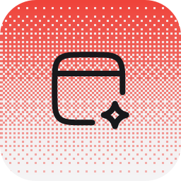

# Ego Browser

  <picture>
    <source media="(prefers-color-scheme: dark)" srcset="./icon-dark.png" />
    
  </picture>

Ego Browser is an optional browser.control provider for Ryu, backed by [Ego
lite](https://github.com/citrolabs/ego-lite). It lets agents keep using Ryu's
stable browser.* tools while their tabs, login state, and task-space isolation
come from Ego.

## Setup

1. Install the Ego lite app and complete its onboarding. Ego lite currently
   supports macOS; check the upstream project for platform updates.
2. Make sure the ego-browser command is available to the Ryu Core process.
3. Install and enable **Ego Browser** from Ryu's Marketplace.
4. In the node's Layers or capability-provider settings, select **Ego Browser**
   for browser.control.

The provider maps all seven canonical browser verbs:

| Ryu tool | Ego operation |
|---|---|
| browser.tabs | browser.listTabs() |
| browser.navigate | browser.openOrReuseTab() |
| browser.snapshot | page.snapshotRaw() |
| browser.click | page.locator(ref).click() |
| browser.type | page.locator(ref).fill() and optional Enter |
| browser.scroll | page.mouse.wheel() |
| browser.screenshot | cdp("Page.captureScreenshot") |

Ryu derives a stable Ego Space name from the calling conversation, so a later
tool call in the same conversation can continue with the same tabs. Agents do
not need a new skill or a new tool namespace. To return to Agent Browser, change
the browser.control provider back to **Agent Browser** or disable this plugin.

## Security and limits

The bridge is a fixed inline_deno tool: it starts only ego-browser nodejs with a
fixed argument list, passes the validated JSON input into a generated Node.js
helper program, and never invokes a shell. It requests child-process permission
but no direct filesystem or network permission; web traffic and authentication
stay inside Ego lite. Ryu does not copy or expose Ego's login state.

This package intentionally provides the canonical browsing surface only. Agent
Browser's recording and live-stream extras are not part of this provider.
